# LIO-SAM

**一个实时激光-惯性里程计包。我们强烈建议用户仔细阅读本文档，并先使用提供的示例数据集测试本包。方法的演示视频可在 [YouTube](https://www.youtube.com/watch?v=A0H8CoORZJU) 上观看。**

<p align='center'>
    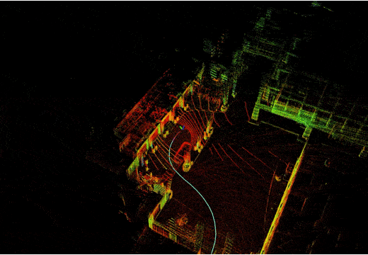
</p>

<p align='center'>
    
    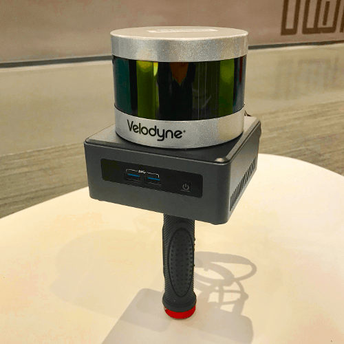
    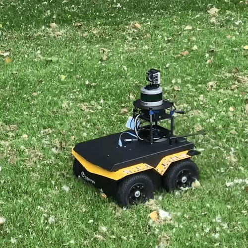
    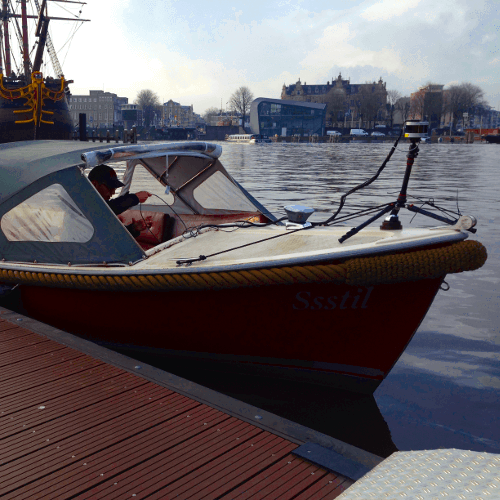
</p>

## 目录

  - [**系统架构**](#系统架构)

  - [**ROS2 分支说明**](#ros2-分支说明)

  - [**包依赖**](#依赖)

  - [**包安装**](#安装)

  - [**准备激光雷达数据**](#准备激光雷达数据)（必读）

  - [**准备 IMU 数据**](#准备-imu-数据)（必读）

  - [**示例数据集**](#示例数据集)

  - [**运行本包**](#运行本包)

  - [**其他说明**](#其他说明)

  - [**常见问题**](#常见问题)

  - [**论文**](#论文)

  - [**待办事项**](#待办事项)

  - [**相关包**](#相关包)

  - [**致谢**](#致谢)

## 系统架构

<p align='center'>
    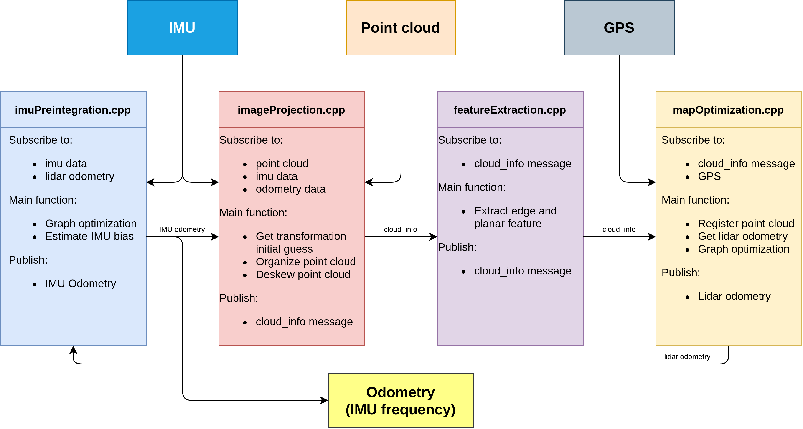
</p>

我们设计了一个维护两个因子图的系统，运行速度可达实时性能的 10 倍以上：
  - `mapOptimization.cpp` 中的因子图用于优化激光里程计因子和 GPS 因子，在整个测试过程中持续维护。
  - `imuPreintegration.cpp` 中的因子图用于优化 IMU 和激光里程计因子，并估计 IMU 偏置，周期性地重置并保证以 IMU 频率进行实时里程计估计。

## ROS2 分支说明

原始 ROS1 版本中的以下功能在当前 ROS2 版本中暂未实现：
- 未测试 Velodyne 和 Livox 激光雷达以及 Microstrain IMU
- 缺少 navsat 模块 / GPS 因子的启动文件
- RViz2 配置缺少部分可视化元素

本分支已在以下设备组合上通过测试：Ouster 激光雷达配合 Xsens IMU 和 SBG-Systems IMU，使用如下 ROS2 驱动：
- [ros2_ouster_drivers](https://github.com/ros-drivers/ros2_ouster_drivers)
- [bluespace_ai_xsens_ros_mti_driver](https://github.com/bluespace-ai/bluespace_ai_xsens_ros_mti_driver)
- [sbg_ros2_driver](https://github.com/SBG-Systems/sbg_ros2_driver)

测试中，IMU 安装在激光雷达底部，两者的 X 轴指向相同方向。`params.yaml` 中的 `extrinsicRot` 和 `extrinsicRPY` 参数对应此安装方式。

## 依赖

已在 ROS2 Foxy 和 Galactic（Ubuntu 20.04）以及 Humble（Ubuntu 22.04）上测试。
- [ROS2](https://docs.ros.org/en/humble/Installation.html)
  ```
  sudo apt install ros-<ros2-版本>-perception-pcl \
           ros-<ros2-版本>-pcl-msgs \
           ros-<ros2-版本>-vision-opencv \
           ros-<ros2-版本>-xacro
  ```
- [gtsam](https://gtsam.org/get_started)（Georgia Tech 平滑与建图库）
  ```
  # 添加 GTSAM PPA 源
  sudo add-apt-repository ppa:borglab/gtsam-release-4.1
  sudo apt install libgtsam-dev libgtsam-unstable-dev
  ```

## 安装

使用以下命令下载并编译本包：

  ```
  cd ~/ros2_ws/src
  git clone https://github.com/TixiaoShan/LIO-SAM.git
  cd LIO-SAM
  git checkout ros2
  cd ..
  colcon build
  ```

## 使用 Docker

构建镜像（基于 ROS2 Humble）：

```
docker build -t liosam-humble-jammy .
```

获取镜像后，可以通过以下方式之一启动容器：

1. `docker run`

```
docker run --init -it -d \
  --name liosam-humble-jammy-container \
  -v /etc/localtime:/etc/localtime:ro \
  -v /etc/timezone:/etc/timezone:ro \
  -v /tmp/.X11-unix:/tmp/.X11-unix \
  -e DISPLAY=$DISPLAY \
  --runtime=nvidia --gpus all \
  liosam-humble-jammy \
  bash
```

2. `docker compose`

启动 docker compose 容器：

```
docker compose up -d
```

停止 docker compose 容器：
```
docker compose down
```

进入运行中的容器：

```
docker exec -it liosam-humble-jammy-container bash
```

## 准备激光雷达数据

用户需要以正确的格式准备点云数据以进行点云去畸变，该功能主要在 `imageProjection.cpp` 中实现。两个要求如下：
  - **提供点时间戳**。LIO-SAM 使用 IMU 数据进行点云去畸变，因此需要知道每个点在当前扫描中的相对时间。最新版 Velodyne ROS 驱动应直接输出此信息。这里假设点时间通道名为 "time"，点类型定义位于 `imageProjection.cpp` 顶部。`deskewPoint()` 函数利用相对时间获取该点相对于扫描起始时刻的位姿变换。当激光雷达以 10Hz 旋转时，点的时间戳应在 0 到 0.1 秒之间。如果使用其他激光雷达传感器，可能需要更改时间通道的名称，并确保它是扫描内的相对时间。
  - **提供点环号**。LIO-SAM 使用此信息将点正确组织到矩阵中。环号表示该点属于传感器的哪个通道。点类型定义位于 `imageProjection.cpp` 顶部。最新版 Velodyne ROS 驱动应直接输出此信息。同样，如果使用其他激光雷达传感器，可能需要重命名此信息。注意：当前仅支持机械式激光雷达。

## 准备 IMU 数据

  - **IMU 要求**。与原始 LOAM 实现相同，LIO-SAM 仅支持 9 轴 IMU，能够提供横滚、俯仰和偏航角估计。横滚和俯仰角估计主要用于以正确姿态初始化系统；偏航角估计在使用 GPS 数据时以正确航向初始化系统。理论上，类似 VINS-Mono 的初始化过程可以使 LIO-SAM 支持 6 轴 IMU。系统的性能在很大程度上取决于 IMU 测量数据的质量。IMU 数据速率越高，系统精度越好。我们使用 Microstrain 3DM-GX5-25，输出频率为 500Hz。建议使用输出速率至少 200Hz 的 IMU。注意：Ouster 激光雷达的内置 IMU 为 6 轴 IMU。

  - **IMU 对齐**。LIO-SAM 将 IMU 原始数据从 IMU 坐标系变换到激光雷达坐标系，遵循 ROS REP-105 约定（x — 前，y — 左，z — 上）。为使系统正常工作，需要在 `params.yaml` 文件中提供正确的外参变换。**之所以存在两组外参，是因为我的 IMU（Microstrain 3DM-GX5-25）的加速度和姿态使用不同的坐标系。根据 IMU 厂商的不同，两组外参可能相同也可能不同**：
    - `params.yaml` 中的 `extrinsicRot` 是将 IMU 陀螺仪和加速度计测量值变换到激光雷达坐标系的旋转矩阵。
    - `params.yaml` 中的 `extrinsicRPY` 是将 IMU 方向变换到激光雷达坐标系的旋转矩阵。

  - **IMU 调试**。强烈建议用户取消 `imageProjection.cpp` 中 `imuHandler()` 函数内的调试代码注释，并检查 IMU 变换后的输出数据。用户可以旋转传感器组件来验证读数是否与实际运动一致。展示校正后 IMU 数据的 YouTube 视频可在 [此处（YouTube 链接）](https://youtu.be/BOUK8LYQhHs) 查看。

<p align='center'>
    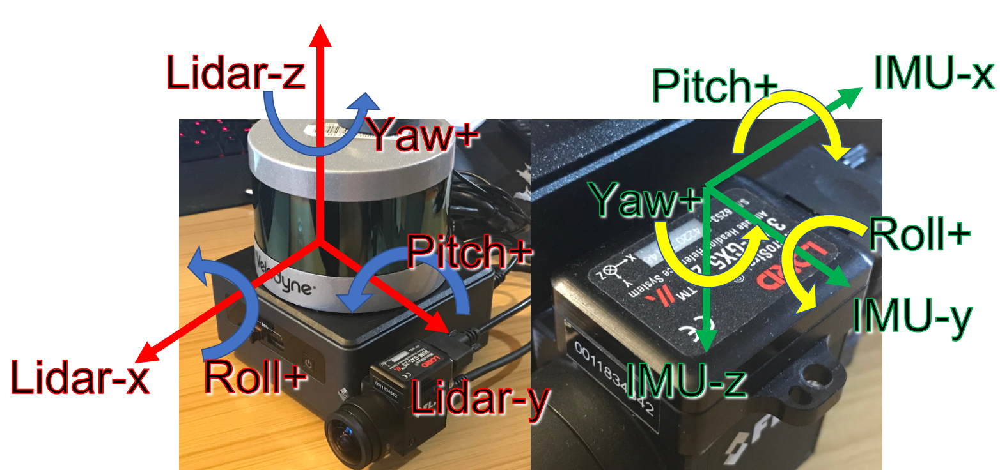
</p>
<p align='center'>
    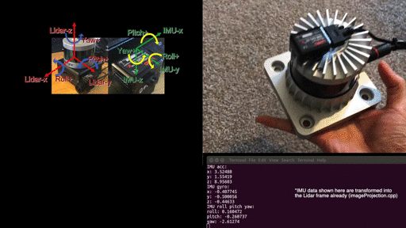
</p>

## 示例数据集

出于隐私原因，当前无法提供 ROS2 版本的示例数据集。

主分支的 README.md 包含一些 ROS1 rosbag 的链接。可以通过 [ros1_bridge](https://github.com/ros2/ros1_bridge) 使用这些 rosbag，但需先验证时序行为（ROS2 中的消息频率）。注意 [DDS 调优](https://docs.ros.org/en/humble/How-To-Guides/DDS-tuning.html)。

## 运行本包

1. 运行启动文件：
```
ros2 launch lio_sam run.launch.py
```

2. 播放已有的 bag 文件：
```
ros2 bag play 你的-bag.bag
```

## 保存地图
```
ros2 service call /lio_sam/save_map lio_sam/srv/SaveMap
```
```
ros2 service call /lio_sam/save_map lio_sam/srv/SaveMap "{resolution: 0.2, destination: /Downloads/service_LOAM}"
```

## 其他说明

  - **回环检测：** 此处的回环功能为概念验证示例，直接改编自 LeGO-LOAM 的回环检测。如需更高级的回环检测实现，请参考 [ScanContext](https://github.com/irapkaist/SC-LeGO-LOAM)。将 `params.yaml` 中的 `loopClosureEnableFlag` 设为 `true` 以测试回环检测功能。在 RViz 中，取消勾选 "Map (cloud)" 并勾选 "Map (global)"，因为可视化的 "Map (cloud)" 地图只是 RViz 中简单堆叠的点云，其位置在姿态校正后不会更新。这里的回环功能直接改编自 LeGO-LOAM，是基于 ICP 的方法。由于 ICP 运行较慢，建议将播放速度设为 `-r 1`。可以尝试使用 Garden 数据集进行测试。

<p align='center'>
    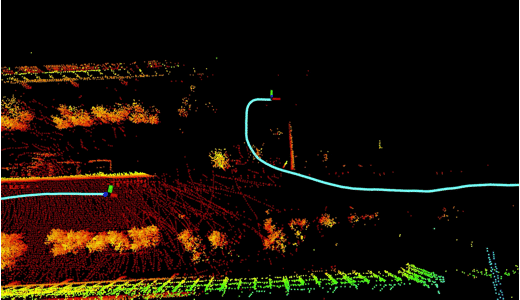
    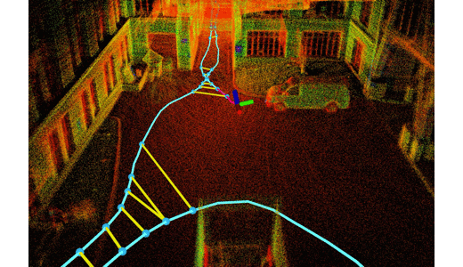
</p>

  - **使用 GPS：** 提供 park 数据集用于测试 LIO-SAM 的 GPS 功能，该数据集由 [黄业伟](https://robustfieldautonomylab.github.io/people.html) 采集。要启用 GPS 功能，将 `params.yaml` 中的 `gpsTopic` 改为 `odometry/gps`。在 RViz 中，取消勾选 "Map (cloud)" 并勾选 "Map (global)"，同时勾选 "Odom GPS" 以可视化 GPS 里程计。`gpsCovThreshold` 可用于过滤质量较差的 GPS 读数。`poseCovThreshold` 用于调整向因子图添加 GPS 因子的频率。例如，当 `poseCovThreshold` 设为 1.0 时，你会注意到轨迹被 GPS 持续修正。由于 iSAM 优化计算量较大，建议播放速度为 `-r 1`。

<p align='center'>
    
</p>

  - **KITTI：** 由于 LIO-SAM 需要高频 IMU 才能正常工作，我们需要使用 KITTI 原始数据进行测试。一个尚未解决的问题是 IMU 的内参未知，这对 LIO-SAM 的精度有较大影响。下载提供的示例数据并在 `params.yaml` 中做以下修改：
    - extrinsicTrans: [-8.086759e-01, 3.195559e-01, -7.997231e-01]
    - extrinsicRot: [9.999976e-01, 7.553071e-04, -2.035826e-03, -7.854027e-04, 9.998898e-01, -1.482298e-02, 2.024406e-03, 1.482454e-02, 9.998881e-01]
    - extrinsicRPY: [9.999976e-01, 7.553071e-04, -2.035826e-03, -7.854027e-04, 9.998898e-01, -1.482298e-02, 2.024406e-03, 1.482454e-02, 9.998881e-01]
    - N_SCAN: 64
    - downsampleRate: 2 或 4
    - loopClosureEnableFlag: true 或 false

<p align='center'>
    
    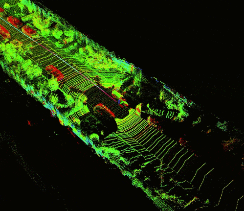
</p>

  - **Ouster 激光雷达：** 要使 LIO-SAM 与 Ouster 激光雷达兼容，需要在硬件和软件层面做一些准备：
    - 硬件：
      - 使用外部 IMU。LIO-SAM 不支持 Ouster 激光雷达内置的 6 轴 IMU，需要外接一个 9 轴 IMU 进行数据采集。
      - 配置驱动。将 Ouster 启动文件中的 `timestamp_mode` 改为 `TIME_FROM_PTP_1588`，以便点云获得 ROS 格式的时间戳。
    - 配置：
      - 将 `params.yaml` 中的 `sensor` 改为 `ouster`。
      - 根据激光雷达型号修改 `params.yaml` 中的 `N_SCAN` 和 `Horizon_SCAN`，例如 N_SCAN=128、Horizon_SCAN=1024。
    - 第一代与第二代 Ouster：
      不同代产品的点坐标定义可能不同，请参考 [Issue #94](https://github.com/TixiaoShan/LIO-SAM/issues/94) 进行调试。

<p align='center'>
    
    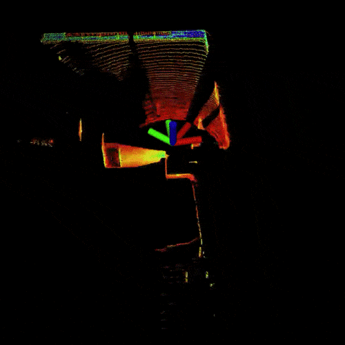
</p>

## 常见问题

  - **锯齿状或抖动行为：** 如果激光雷达和 IMU 数据格式符合 LIO-SAM 的要求，该问题很可能由激光雷达和 IMU 数据时间戳不同步引起。

  - **上下跳动：** 如果开始播放 bag 文件后 base_link 立即开始上下跳动，很可能是 IMU 外参不正确导致的，例如重力加速度出现负值。

  - **mapOptimization 崩溃：** 通常由 GTSAM 引起。请按照本 README.md 中的说明安装指定版本的 GTSAM。更多类似问题可参见 [此处](https://github.com/TixiaoShan/LIO-SAM/issues)。

  - **GPS 里程计不可用：** 一般是由于消息 frame_id 与机器人 frame_id 之间的坐标变换不可用（例如，需要提供从 `imu_frame_id` 和 `gps_frame_id` 到 `base_link` 的坐标变换）。请参阅 [Robot Localization 文档](http://docs.ros.org/en/melodic/api/robot_localization/html/preparing_sensor_data.html)。

## 论文

如果你使用了本项目的任何代码，请引用 [LIO-SAM (IROS-2020)](./config/doc/paper.pdf)：
```
@inproceedings{liosam2020shan,
  title={LIO-SAM: Tightly-coupled Lidar Inertial Odometry via Smoothing and Mapping},
  author={Shan, Tixiao and Englot, Brendan and Meyers, Drew and Wang, Wei and Ratti, Carlo and Rus Daniela},
  booktitle={IEEE/RSJ International Conference on Intelligent Robots and Systems (IROS)},
  pages={5135-5142},
  year={2020},
  organization={IEEE}
}
```

部分代码改编自 [LeGO-LOAM](https://github.com/RobustFieldAutonomyLab/LeGO-LOAM)：
```
@inproceedings{legoloam2018shan,
  title={LeGO-LOAM: Lightweight and Ground-Optimized Lidar Odometry and Mapping on Variable Terrain},
  author={Shan, Tixiao and Englot, Brendan},
  booktitle={IEEE/RSJ International Conference on Intelligent Robots and Systems (IROS)},
  pages={4758-4765},
  year={2018},
  organization={IEEE}
}
```

## 待办事项

  - [ ] [imuPreintegration 中的 Bug](https://github.com/TixiaoShan/LIO-SAM/issues/104)

## 相关包

  - [激光雷达-IMU 标定](https://github.com/chennuo0125-HIT/lidar_imu_calib)
  - [集成 Scan Context 的 LIO-SAM](https://github.com/gisbi-kim/SC-LIO-SAM)

## 致谢

  - LIO-SAM 基于 LOAM（J. Zhang and S. Singh. LOAM: Lidar Odometry and Mapping in Real-time）。
