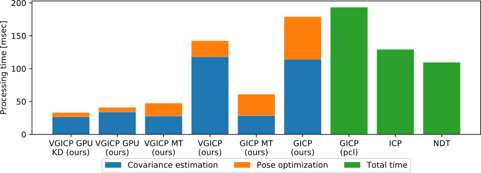

# 注意：已发布更快的新库

我们发布了 [small_gicp](https://github.com/koide3/small_gicp)，速度是 fast_gicp 的两倍，具有最小依赖和清晰的接口。

# fast_gicp

本包是一组基于 GICP 的快速点云配准算法的集合。包含多线程 GICP 以及我们提出的体素化 GICP（VGICP）算法的多线程和 GPU 实现。所有实现的算法均提供 PCL 配准接口，可作为 PCL 中 GICP 的直接替代方案。

- FastGICP：多线程 GICP 算法（**约 40 FPS**）
- FastGICPSingleThread：针对单线程优化的 GICP 算法（**约 15 FPS**）
- FastVGICP：多线程体素化 GICP 算法（**约 70 FPS**）
- FastVGICPCuda：CUDA 加速的体素化 GICP 算法（**约 120 FPS**）
- NDTCuda：CUDA 加速的 D2D NDT 算法（**约 500 FPS**）



[](https://github.com/SMRT-AIST/fast_gicp/actions/workflows/build.yml) 在 melodic 和 noetic 上通过

## 安装

### 依赖
- PCL
- Eigen
- OpenMP
- CUDA（可选）
- [Sophus](https://github.com/strasdat/Sophus)
- [nvbio](https://github.com/NVlabs/nvbio)

我们已在 Ubuntu 18.04/20.04 和 CUDA 11.1 上测试本包。

在 macOS 上使用 `brew` 时，可能需要如下配置依赖：

```
cmake .. "-DCMAKE_PREFIX_PATH=$(brew --prefix libomp)[;其他自定义前缀]" -DQt5_DIR=$(brew --prefix qt@5)lib/cmake/Qt5
```

### CUDA

要启用 CUDA 加速实现，将 `BUILD_VGICP_CUDA` cmake 选项设为 `ON`。

### ROS
```bash
cd ~/catkin_ws/src
git clone https://github.com/SMRT-AIST/fast_gicp --recursive
cd .. && catkin_make -DCMAKE_BUILD_TYPE=Release
# 启用 CUDA 实现
# cd .. && catkin_make -DCMAKE_BUILD_TYPE=Release -DBUILD_VGICP_CUDA=ON
```

### 非 ROS 环境
```bash
git clone https://github.com/SMRT-AIST/fast_gicp --recursive
mkdir fast_gicp/build && cd fast_gicp/build
cmake .. -DCMAKE_BUILD_TYPE=Release
# 启用 CUDA 实现
# cmake .. -DCMAKE_BUILD_TYPE=Release -DBUILD_VGICP_CUDA=ON
make -j8
```

### Python 绑定
```bash
cd fast_gicp
python3 setup.py install --user
```
注意：如果在 catkin 环境下安装遇到问题，请注释 CMakeLists.txt 中的 `find_package(catkin)` 并重新运行上述安装命令。

```python
import pygicp

target = # Nx3 numpy 数组
source = # Mx3 numpy 数组

# 1. 函数式接口
matrix = pygicp.align_points(target, source)

# 可选参数
# initial_guess               : 相对位姿的初始估计（4x4 矩阵）
# method                      : GICP, VGICP, VGICP_CUDA 或 NDT_CUDA
# downsample_resolution       : 降采样分辨率（仅在正值时使用）
# k_correspondences           : 用于协方差估计的点数
# max_correspondence_distance : 对应点搜索的最大距离
# voxel_resolution            : 体素化算法的体素分辨率
# neighbor_search_method      : DIRECT1, DIRECT7, DIRECT27 或 DIRECT_RADIUS
# neighbor_search_radius      : 邻域体素搜索半径（用于 GPU 方法）
# num_threads                 : 线程数

# 2. 类式接口
# 配准前可先对输入点云降采样
target = pygicp.downsample(target, 0.25)
source = pygicp.downsample(source, 0.25)

# pygicp.FastGICP 接口与 C++ 版本基本一致
gicp = pygicp.FastGICP()
gicp.set_input_target(target)
gicp.set_input_source(source)
matrix = gicp.align()

# 可选配置
gicp.set_num_threads(4)
gicp.set_max_correspondence_distance(1.0)
gicp.get_final_transformation()
gicp.get_final_hessian()
```

## 性能基准测试
CPU：Core i9-9900K，GPU：GeForce RTX2080Ti

```bash
roscd fast_gicp/data
rosrun fast_gicp gicp_align 251370668.pcd 251371071.pcd
```

```
目标:17249[点] 源:17518[点]
--- pcl_gicp ---
单次:127.508[毫秒] 100次:12549.4[毫秒] 匹配分数:0.204892
--- pcl_ndt ---
单次:53.5904[毫秒] 100次:5467.16[毫秒] 匹配分数:0.229616
--- fgicp_st ---
单次:111.324[毫秒] 100次:10662.7[毫秒] 100次(复用):6794.59[毫秒] 匹配分数:0.204379
--- fgicp_mt ---
单次:20.1602[毫秒] 100次:1585[毫秒] 100次(复用):1017.74[毫秒] 匹配分数:0.204412
--- vgicp_st ---
单次:112.001[毫秒] 100次:7959.9[毫秒] 100次(复用):4408.22[毫秒] 匹配分数:0.204067
--- vgicp_mt ---
单次:18.1106[毫秒] 100次:1381[毫秒] 100次(复用):806.53[毫秒] 匹配分数:0.204067
--- vgicp_cuda (parallel_kdtree) ---
单次:15.9587[毫秒] 100次:1451.85[毫秒] 100次(复用):695.48[毫秒] 匹配分数:0.204061
--- vgicp_cuda (gpu_bruteforce) ---
单次:53.9113[毫秒] 100次:3463.5[毫秒] 100次(复用):1703.41[毫秒] 匹配分数:0.204049
--- vgicp_cuda (gpu_rbf_kernel) ---
单次:5.91508[毫秒] 100次:590.725[毫秒] 100次(复用):226.787[毫秒] 匹配分数:0.20557
```

详细用法参见 [src/align.cpp](https://github.com/SMRT-AIST/fast_gicp/blob/master/src/align.cpp)。

## KITTI 数据集测试

### C++

```bash
# 逐帧配准
rosrun fast_gicp gicp_kitti /你的/kitti/路径/sequences/00/velodyne
```


### Python

```bash
cd fast_gicp/src
python3 kitti.py /你的/kitti/路径/sequences/00/velodyne
```

## 注意事项

在某些环境下，设置较少的线程数（而非默认的最大线程数）可能反而获得更快的处理速度（参见 https://github.com/SMRT-AIST/fast_gicp/issues/145#issuecomment-1890885373）。

## 相关包
- [ndt_omp](https://github.com/koide3/ndt_omp)
- [fast_gicp](https://github.com/SMRT-AIST/fast_gicp)

## 论文
- Kenji Koide, Masashi Yokozuka, Shuji Oishi, and Atsuhiko Banno, "Voxelized GICP for Fast and Accurate 3D Point Cloud Registration", ICRA 2021 [[链接]](https://easychair.org/publications/preprint/ftvV)

## 联系方式
Kenji Koide, k.koide@aist.go.jp

日本国立产业技术综合研究所（AIST），人类中心移动研究中心 [\[URL\]](https://unit.aist.go.jp/rirc/en/team/smart_mobility.html)
