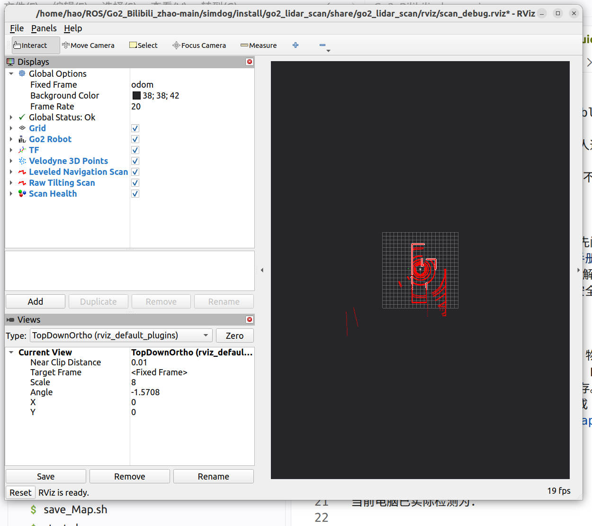

# go2_lidar_scan

本包是 Go2 仿真的唯一三维点云转二维扫描入口。投影继续复用 BSD-3-Clause 的
[ros-perception/pointcloud_to_laserscan](https://github.com/ros-perception/pointcloud_to_laserscan)，
没有重新实现成熟算法；本包负责重力对齐 TF、参数、诊断、RViz 和可重复证据。

## 当前判断：`0.48..0.60 m` 是当前仿真场景固化高度窗

机器狗原地转向时，`base_footprint -> velodyne` 会产生约 `4–6°` roll/pitch。旧链路直接
在倾斜的 `velodyne` 中截取 `-0.05..0.10 m` 点层，地面点会进入二维角度格并成为最近
端点。Slam Toolbox 把这些端点写进 `/map`，ObstacleLayer 再把它们膨胀，于是看到从
机器人向空区延伸的白线和青/粉色“孤岛”。提高刷新率只能更快擦掉错误，不能阻止错误
端点产生。这是已经由逐帧数据证明的一条成因，但不是现场全部成因。

当前链路为：

```text
/velodyne_points
       │ 同时间戳查询 base_footprint -> velodyne
       ├─ go2_lidar_level_frame：保留平移和 yaw，roll/pitch 置零
       │                         └─ TF: base_footprint -> velodyne_level
       └─ 同时间戳 TF 成功后放行 /go2_lidar_scan/leveled_cloud
          └─ pointcloud_to_laserscan(target_frame=velodyne_level)
                                  └─ /scan (frame_id=velodyne_level)
```

`pointcloud_to_laserscan` 会先把点云转进 `target_frame`，再做高度过滤，这正是必须先对齐
重力、后切片的原因。`level_frame_publisher` 运行态使用 C++，避免 Python 重复解析整棵
四足高频 TF 树；TF 查询失败、时间戳不可用或四元数非法时不会复用上一帧。

2026-08-22 仿真运动采样达到 `5.15°` 机身倾斜：同一批点按旧坐标投影有 `4430`
个地面获胜角度格，重力对齐后为 `0`；240 个采样点云均找到同时间戳 TF，所有已发布
`/scan` 的 frame 与 TF 验证均为 100%，`velodyne_level` 最大 roll/pitch 为 `0°`。
`/scan` 墙钟频率为 `8.89 Hz`，`map -> odom` 最大单步修正为
`0.0224 m / 0.00698 rad`。这只能判定“该批样本中的地面端点门”为 PASS。

随后人工在线 SLAM 在 `+0.05..+0.20 m` 仍看到白色扇形线和幽灵代价岛；用户再通过
rqt 把窗口改为 `min_height=0.20 m`、`max_height=0.30 m` 后，现场目视建图恢复正常。
这是 2026-08-22 的过渡基线。2026-08-25 用户在 `0.48..0.60 m` 完成当前高墙
场景的在线覆盖并保存 `my_world_full_v1`，随后明确要求重启后继续使用该值，
因此正式 YAML 现固化为 `+0.48..+0.60 m`。这只证明当前高墙场景成图可用；
高窗更易漏掉矮障碍，完整近距 Collision Monitor 几何仍未验收。
历史原始 CSV/JSON 位于
[`logs/motion_scan_final_900_20260822`](logs/motion_scan_final_900_20260822/)。

## 对外接口

| 接口 | 用途 |
|---|---|
| `/scan` | 默认重力对齐扫描，供 Slam Toolbox、AMCL、Nav2、Collision Monitor 使用 |
| `/scan_raw` | 仅 `lidar_debug_raw_scan:=true` 时启动的原始倾斜扫描，不接入下游 |
| `velodyne_level` | 与雷达同位置、只保留 yaw 的动态 TF |
| `/diagnostics` | 频率、延迟、帧名、量程、当前高度窗、原始姿态、同时间戳 TF 成功率 |
| `/go2_lidar_scan/cloud_heartbeat` | C++ 从每帧点云复制出的轻量 Header，避免诊断重复反序列化整帧点云 |
| `/go2_lidar_scan/leveled_cloud` | 仅在本帧精确 TF 可用后放行给同进程转换器的内部点云，不是新的坐标数据副本 |
| `/go2_lidar_scan/probe_cloud` | 仅有订阅者时每 5 帧发布一次，供只读运动探针取证，不接入导航 |
| `/go2_lidar_scan/markers` | RViz 中文健康文字 |
| `motion_scan_probe` | 只读运动探针；不发布速度，保存 CSV/JSON 到项目内 |

正式 `/scan` 的当前固化高度层为 `+0.48..+0.60 m`；调试 `/scan_raw` 固定保留旧
`-0.05..+0.10 m`。高度是相对 `velodyne_level` 雷达原点的 z，不是离地高度。
`use_inf=true`、量程 `0.90..15.0 m` 保持不变。Nav2 配套使用
`inf_is_valid=true`、`obstacle_max_range=14.0 m`、`raytrace_max_range=15.0 m`，使
`+inf` 只清除、不在远端重新标障碍。异步 Slam Toolbox 按
[Humble 上游文档](https://docs.ros.org/en/humble/p/slam_toolbox/)显式使用
`scan_queue_size=1`。

此前已在隔离无界面 Gazebo 读回过渡正式/原始窗口 `0.20..0.30` 与
`-0.05..0.10 m`；`/scan.frame_id=velodyne_level`，墙钟约 `9.99 Hz`，诊断显示转换链
正常、level roll/pitch 均为 `0°`。这证明默认值实际生效，不替代下文人工完整路线验收。

## 先理解三个终端各自做什么

- **终端 1 是整套试验台**：启动 Gazebo、机器狗、雷达转换、Slam Toolbox、Nav2、
  RViz；加 `tuning_gui:=true` 还会打开高度调节窗口。它必须最先启动。
- **终端 2 是记录仪**：`motion_scan_probe` 只订阅数据，保存 CSV/JSON，绝不会给狗发
  速度。只想肉眼先看 RViz 时可以暂不运行它。
- **终端 3 是遥控器**：键盘命令先进入 `/cmd_vel_teleop`，再经过项目的仲裁、平滑、
  碰撞监控和安全监督，最后才到机器狗。命令中的 `-r cmd_vel:=/cmd_vel_teleop` 就是把
  键盘节点默认出口改接到这条安全入口；不能删掉。

`source scripts/setup_unitree_sim.bash` 的作用是让该终端加载同一套 ROS 工作空间、DDS
实现、回环网卡和 Domain 0。每开一个新终端都要执行一次；它不是启动命令。

## 三终端在线 SLAM 验证

先清空机器人周围人员和实体障碍。出现失控、RViz 红项或机器人不按预期运动时，在键盘
终端松键并按 `k`/空格，再在任一已加载终端执行：

```bash
ros2 service call /navigation/stop std_srvs/srv/Trigger "{}"
```

终端 1：从空白 pose graph 启动正式在线 SLAM。正常验证不要启用 `/scan_raw`，避免第二
转换器额外占用渲染和 DDS 资源。

```bash
cd /home/luhao/my/ROS/Go2_Bilibili_zhao-main
source scripts/setup_unitree_sim.bash
ros2 launch go2_navigation simulation_navigation.launch.xml \
  map_session:=new rviz:=true lidar_debug_raw_scan:=false \
  use_d435_navigation:=false tuning_gui:=false
```

`map_session:=new` 强制从空白地图开始，否则旧地图里的白线不会因参数改变自动消失；
`use_d435_navigation:=false` 暂时关闭 D435 仿真负载，让本次只使用 LiDAR；
`lidar_debug_raw_scan:=false` 保证导航下游只有一个 `/scan` 发布者。正式建图不打开 rqt，
避免误触参数；只有再次做高度 A/B 时才传 `tuning_gui:=true`。

终端 2：启动只读证据采集。它会提示通过终端 3 驱动，结束后打印 PASS/FAIL 和结果目录。

```bash
cd /home/luhao/my/ROS/Go2_Bilibili_zhao-main
source scripts/setup_unitree_sim.bash
ros2 run go2_lidar_scan motion_scan_probe --duration 150
```

终端 3：键盘只能接入 `/cmd_vel_teleop`，不能直发最终 `/cmd_vel`。

```bash
cd /home/luhao/my/ROS/Go2_Bilibili_zhao-main
source scripts/setup_unitree_sim.bash
ros2 run teleop_twist_keyboard teleop_twist_keyboard \
  --ros-args -r cmd_vel:=/cmd_vel_teleop
```

常用键是 `i` 前进、`,` 后退、`j` 左转、`l` 右转、`k` 停止。依次缓慢完成左转整圈、
右转整圈、前后移动和带四次转弯的闭合路线；每段之间按 `k`。键盘焦点必须停留在终端 3。
退出顺序为先停键盘、确认 `/cmd_vel` 为零，再在终端 1 `Ctrl+C`。健康后解除人工锁停：

```bash
ros2 service call /navigation/resume std_srvs/srv/Trigger "{}"
```

旧目标不会自动续行。

`/navigation/stop` 是项目安全监督的人工锁停：它会屏蔽后续速度并发零速度；
`/navigation/resume` 只在传感器和导航恢复健康后解除这把锁。下面命令只是读取健康状态，
不会让狗移动，也不会自动修复问题：

```bash
ros2 run go2_navigation health_check --mode online_slam --localization amcl
```

在线模式真正的定位来源是 Slam Toolbox；这里的 `--localization amcl` 是健康检查工具要求的
兼容参数，不表示同时启动了 AMCL。看到 FAIL 时先保持停车，再按输出中的具体红项排查。

## 在 rqt 中动态调高度

终端 1 使用 `tuning_gui:=true` 后，rqt 会直接打开
`/go2_lidar_scan_converter`。只调整两项：

如果主启动已运行但窗口被误关，可在另一个已 `source` 的终端重新打开，不会重启雷达：

```bash
ros2 run rqt_gui rqt_gui \
  --standalone rqt_reconfigure.param_plugin.ParamPlugin \
  --args /go2_lidar_scan_converter
```

| 参数 | 物理含义 | 过低/过高的表现 |
|---|---|---|
| `min_height` | 保留点层的下边界（相对水平雷达原点） | 太低容易纳入地面；太高会漏掉矮障碍 |
| `max_height` | 保留点层的上边界 | 太低导致墙体端点太少；太高会把不相关高层压进二维 |

两个旋钮的声明范围都是 `-0.50..1.50 m`，步长为 `0.01 m`；这是为了让
`rqt_reconfigure` 显示有单位感的有限滑块，不代表整个范围都适合正式建图。节点仍会在每次
修改时检查数值有限且 `min_height < max_height`，不合法的组合不会写入正在运行的转换器。

当前项目默认值为 `0.48/0.60 m`。始终满足 `min_height < max_height`；
恢复当前默认值时先把 `max_height` 设为 `0.60`，再把 `min_height` 设为 `0.48`。
非法值会被节点拒绝，终端会
显示原因。

每次修改后确认两处：RViz 的 `Scan Health` 文本应显示新的 `height`，以及：

```bash
ros2 param get /go2_lidar_scan_converter min_height
ros2 param get /go2_lidar_scan_converter max_height
```

参数只在当前进程有效，重启后回到 YAML 默认值。动态调整适合观察 `/scan` 是否还出现扇形
端点；比较 SLAM 地图时，每个候选都必须重启终端 1 并使用新的 `map_session:=new`，否则
先前写进 pose graph 的幽灵白线会污染下一组。

## 完整建图、保存和固定地图导航

### 1. 把环境完整建出来

按前面的终端 1 启动在线 SLAM，再按终端 3 启动键盘。开始前先核对本次确实使用固化值：

```bash
ros2 param get /go2_lidar_scan_converter min_height   # 期望 0.48
ros2 param get /go2_lidar_scan_converter max_height   # 期望 0.60
ros2 topic hz /scan                                   # 稳定后期望不低于 7 Hz
```

不要只绕外墙一圈。推荐按“起点静止 5 秒 → 沿外墙走一圈 → 用平行往返路线覆盖内部 →
绕主要障碍物一圈 → 回到起点附近再闭合一次”的顺序驾驶。直行用 `i`，后退用 `,`，左右
转向用 `j/l`，每次转弯或准备观察地图前按 `k` 停车。RViz 的 `Live SLAM Map` 中：白色是
已确认可通行区，黑色是墙/障碍，灰色是尚未观察区；目标是把计划导航的区域扫成连续白色，
墙线保持单层清晰，不再从机器人位置产生放射线。不要为了填满灰区而贴墙或进入雷达
`0.90 m` 近距盲区。

路线结束后回到起点附近停 5–10 秒，让 Slam Toolbox 完成闭环。若出现新放射线、双墙或
地图整体跳动，本次图不要保存为正式地图；先按 `k`，必要时调用 `/navigation/stop`，排查
后重新以 `map_session:=new` 建图。

### 2. 在线 SLAM 仍运行时保存

另开终端，地图名使用“场景_覆盖范围_版本”，例如 `my_world_full_v1`：

```bash
cd /home/luhao/my/ROS/Go2_Bilibili_zhao-main
source scripts/setup_unitree_sim.bash
bash simdog/src/go2/go2_navigation/scripts/save_online_map.sh my_world_full_v1
```

脚本会整齐保存到
`$GO2_PROJECT_ROOT/go2_maps/online/my_world_full_v1/`，内容为：

```text
map.pgm          固定二维栅格图
map.yaml         地图分辨率、原点与 PGM 路径
slam.posegraph   可续建的 Slam Toolbox 位姿图
slam.data        可续建的 Slam Toolbox 数据
session.yaml     保存时间、话题、frame 和实际雷达参数
```

它还会让 `go2_maps/online/latest` 指向这次会话，但正式测试建议写明确目录名。看到脚本四个
阶段全部成功后再检查：

```bash
find "$GO2_PROJECT_ROOT/go2_maps/online/my_world_full_v1" \
  -maxdepth 1 -type f -printf '%f\n' | sort
readlink -f "$GO2_PROJECT_ROOT/go2_maps/online/latest"
sed -n '1,120p' "$GO2_PROJECT_ROOT/go2_maps/online/my_world_full_v1/session.yaml"
```

应看到上述五类文件，`session.yaml` 中应记录 `lidar_min_height_m: 0.48`、
`lidar_max_height_m: 0.6`。
先在键盘终端按 `k` 并 `Ctrl+C`，确认保存成功后再在在线 SLAM 终端 `Ctrl+C`。

### 3. 用保存的固定图测试 AMCL 导航

确认旧的在线 SLAM/Gazebo/RViz 都已退出，再新开终端：

```bash
cd /home/luhao/my/ROS/Go2_Bilibili_zhao-main
source scripts/setup_unitree_sim.bash
ros2 launch go2_navigation simulation_navigation.launch.xml \
  navigation_mode:=static_map localization:=amcl \
  map_dir:=$GO2_PROJECT_ROOT/go2_maps/online/my_world_full_v1 \
  controller_profile:=forward_mppi gui:=true rviz:=true \
  tuning_gui:=false
```

在 RViz 先点工具栏 `2D Pose Estimate`，在地图上机器人实际出生位置按住拖出朝向箭头。
等待粒子和机器人轮廓与地图墙线对齐、`Navigation: active` 后，再点 `Nav2 Goal`。测试顺序
是：空旷区 1–2 m 短目标、带 90° 转弯目标、较长走廊目标、返回起点附近。目标只点白色
自由区，避开黑墙、青/粉膨胀区和灰色未知区。

另开已加载环境的终端核对地图来源和健康状态：

```bash
ros2 param get /map_server yaml_filename
ros2 lifecycle get /map_server
ros2 run go2_navigation health_check \
  --mode static_map --localization amcl \
  --map-dir "$GO2_PROJECT_ROOT/go2_maps/online/my_world_full_v1"
```

`yaml_filename` 必须指向本次 `map.yaml`，lifecycle 期望 `active [3]`。合格表现是规划线连续、
机器人和扫描不相对墙体跳动、代价图无脱离真实障碍的岛，四类目标都能安全到达。普通取消
点 RViz `Navigation 2 -> Cancel`；异常先调用 `/navigation/stop`，修复且健康检查无红项后
再 `/navigation/resume`，旧目标不会自动恢复。

## 独立 RViz A/B

不要与完整导航同时启动独立入口，否则会产生两个 `/scan` 发布者：

```bash
source scripts/setup_simdog.bash
GO2_D435_GAZEBO_ENABLED=0 \
ros2 launch go2_lidar_scan simulation_scan_debug.launch.xml \
  lidar_debug_raw_scan:=true tuning_gui:=true
```

这是“只看传感器、不启动 SLAM/Nav2”的独立试验：`GO2_D435_GAZEBO_ENABLED=0` 只为关闭
D435 以减少 GPU/CPU 负载；`lidar_debug_raw_scan:=true` 才会额外产生旧高度窗的
`/scan_raw`。它与完整导航二选一，不能同时运行，否则会出现两个 `/scan` 发布者。

- `Velodyne 3D Points`：原始三维点云；
- `Leveled Navigation Scan`：默认 `/scan`，橙色；
- `Raw Tilting Scan`：调试 `/scan_raw`，洋红色；
- `Scan Health`：中文健康 Marker。绿色正常，橙色为低频/跳变警告，红色为超时、帧名或
  TF 错误。先停车，再展开该 Display 或执行 `ros2 topic echo /diagnostics --once`。



上图是本轮最终清洁重启后的真实运行截图：`Global Status: Ok`，两个 LaserScan Display、
原始点云、TF 和健康 Marker 均已加载。同次运行 `/scan` 实测约 `9.15 Hz`，Marker 为绿色，
显示对齐姿态 `0.00°/0.00°`。红色折线是 `/scan_raw` 的显示颜色，不代表错误状态；左侧
Display 名称旁只有红色折线图标时，应展开 Display 查看 Status，而不是按颜色猜测健康度。

## 当前验收边界

先前仿真样本已实测通过：

- 机身倾斜超过 `3°`；重力对齐地面获胜端点总数为 0；
- `/scan.frame_id=velodyne_level`，同时间戳 TF 成功率 100%；
- 完整在线栈 `/scan=8.89 Hz`，独立 RViz A/B 约 `9.15 Hz`，均高于 `7 Hz` 门限；
- `map -> odom` 最大单步修正为 `0.0224 m / 0.00698 rad`；
- 2 m 方块三组各 30 帧检出率均 100%；实际删除后精确方块区域 lethal 格从 64 降至
  57（删除前背景为 55），`+inf` clearing 未被破坏。

性能 A/B 也保留：1800 水平列版本的同类运动几何仍为 PASS，但完整栈只有 `5.06 Hz`；
降为 900 列（0.4°）后达到 `8.89 Hz`。历史上单独使用 900 列并不能消灭幽灵障碍，故
`velodyne_level` 消除了该样本中的倾斜地面端点，900 列只是让 Gazebo 达到实时门限。
但人工在线 SLAM 仍复现扇形白线，所以这两项都不能再称为整体根治。最终 135 秒运行中
两张 costmap 合计出现 2 次 `MessageFilter OutTheBack` 丢帧；它们是跳过旧观测，不会
产生错误端点，但仍作为低频时序残余记录，不能写成零丢帧。
证据目录及每次 PASS/FAIL 的含义见 [`logs/README.md`](logs/README.md)。

## 为什么实测后仍保留 0.90 m

重力对齐闭环通过后，已把 Gazebo `ray` 与插件两处量程、转换器、Slam Toolbox、AMCL
和诊断期望值作为一个变量组临时改为 `0.50 m`，并在前、后、左、右方向对
`0.50/0.70/0.90/1.10 m` 各做三组、每组 10 帧。前、左方向全部 100% 检出且无接触；
后方 `0.50 m` 三组均 0% 检出且约 2942–3000 次接触，右方虽 100% 检出但约
965–1016 次接触。因此 `0.50 m` 未通过“无接触、无自体点”门，所有配置已一致恢复
`0.90 m`。`0.70 m` 在本次四方向短测中通过，可作为以后重做 footprint/接触模型后
的候选，但不能据此跳过本计划的保守默认值。不能只降低 `/scan.range_min`：Gazebo 已在
传感器层丢掉的近距回波不会凭空恢复。

真实 VLP-16 不同硬件/标定状态的短距能力有差异，参见
[Ouster/Velodyne 最小量程说明](https://community.ouster.com/t/minimum-range-of-vlp16-puck/277)。
原始结果见 `logs/min_range_050_*_20260822/`。当前近场安全仍应交给经验证的独立近距
传感器；本次通过的是雷达投影与 SLAM 幽灵端点闭环，不等于 Collision Monitor 的
0.90 m 内近距防撞闭环已经通过。

## 上游依据与取舍

- 投影继续复用 BSD-3-Clause 的
  [pointcloud_to_laserscan](https://github.com/ros-perception/pointcloud_to_laserscan)，
  本包只负责 TF 闸门、参数和诊断；
- 动态高度使用 ROS 2 Humble 官方参数回调机制
  [`add_on_set_parameters_callback`](https://docs.ros.org/en/humble/Concepts/Basic/About-Parameters.html)；
  原上游节点只在启动时读取高度，因此本仓库补了最小运行时扩展，而没有改写投影算法；
- 异步队列按 [Slam Toolbox Humble 文档](https://docs.ros.org/en/humble/p/slam_toolbox/)
  固定 `scan_queue_size=1`；
- D435 性能档参考
  [Intel D400 数据表](https://www.intelrealsense.com/wp-content/uploads/2024/10/Intel-RealSense-D400-Series-Datasheet-October-2024.pdf)
  和 Apache-2.0 的
  [pal-robotics/realsense_gazebo_plugin](https://github.com/pal-robotics/realsense_gazebo_plugin)
  ROS 2 示例。这里只提炼分辨率/帧率配置思路，没有复制第三方源码；普通 Gazebo 保留
  相机，导航默认关闭插件是可逆性能档。
