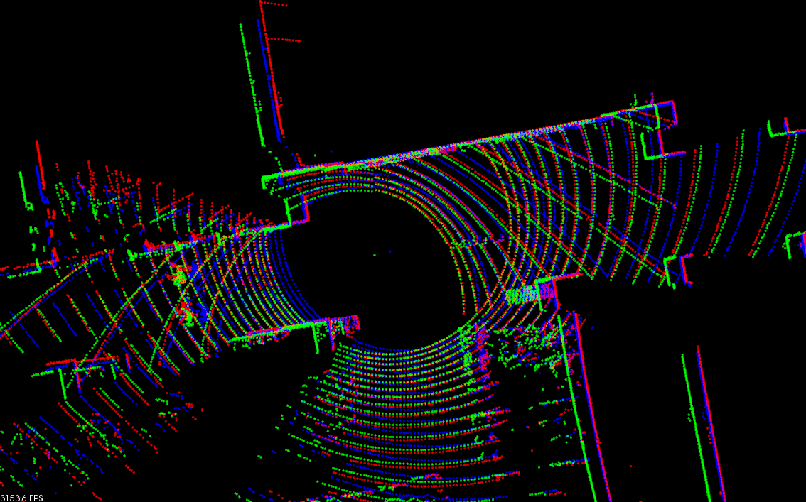

# ndt_omp_ros2

本包提供基于 PCL 衍生、经 OpenMP 加速的 Normal Distributions Transform（NDT）及 GICP 算法。NDT 算法经过 SSE 友好改造并实现多线程化，运行速度可达 PCL 原版的最多 10 倍。

### 性能基准测试
```
$ cd ~/ros2_ws/src/ndt_omp_ros2/data
$ ros2 run ndt_omp_ros2 align 251370668.pcd 251371071.pcd

--- pcl::GICP ---
单次 : 267.385[毫秒]
10次 : 1151.76[毫秒]
匹配分数: 0.220382

--- pclomp::GICP ---
单次 : 173.152[毫秒]
10次 : 1299.14[毫秒]
匹配分数: 0.220388

--- pcl::NDT ---
单次 : 425.142[毫秒]
10次 : 3638.77[毫秒]
匹配分数: 0.213937

--- pclomp::NDT (KDTREE, 1 线程) ---
单次 : 308.935[毫秒]
10次 : 3095.53[毫秒]
匹配分数: 0.213937

--- pclomp::NDT (DIRECT7, 1 线程) ---
单次 : 188.942[毫秒]
10次 : 1373.47[毫秒]
匹配分数: 0.214205

--- pclomp::NDT (DIRECT1, 1 线程) ---
单次 : 41.3584[毫秒]
10次 : 347.261[毫秒]
匹配分数: 0.208511

--- pclomp::NDT (KDTREE, 8 线程) ---
单次 : 108.68[毫秒]
10次 : 1046.16[毫秒]
匹配分数: 0.213937

--- pclomp::NDT (DIRECT7, 8 线程) ---
单次 : 56.9189[毫秒]
10次 : 545.279[毫秒]
匹配分数: 0.214205

--- pclomp::NDT (DIRECT1, 8 线程) ---
单次 : 16.7266[毫秒]
10次 : 169.097[毫秒]
匹配分数: 0.208511
```

实现了多种邻域体素搜索方法。若选择 `pclomp::KDTREE`，结果将与原始 `pcl::NDT` 完全一致。推荐使用 `pclomp::DIRECT7`，速度更快且稳定。若需要极快的配准速度，可选择 `pclomp::DIRECT1`，但可能略有波动。

<br>
红色：目标点云，绿色：源点云，蓝色：配准后点云
