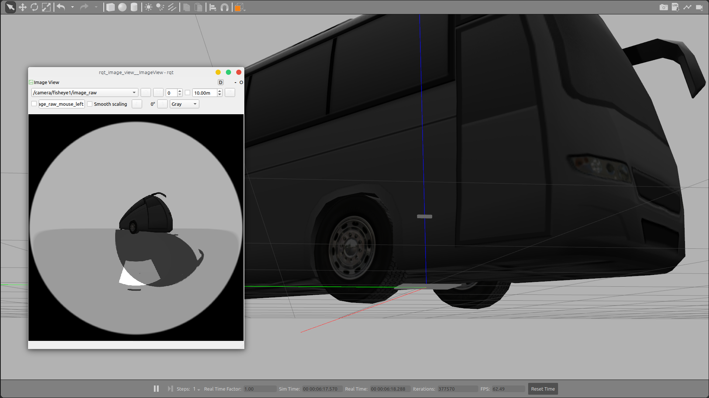
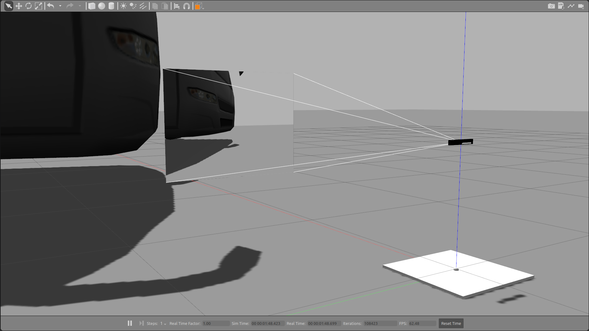
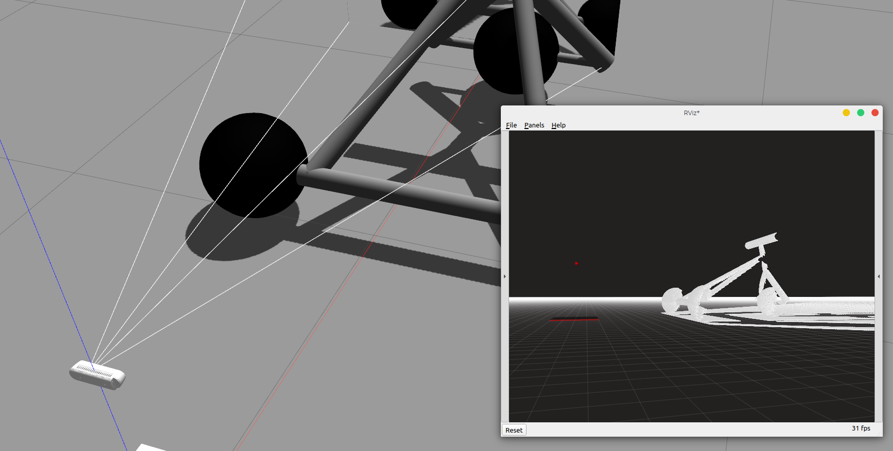

# Intel RealSense Gazebo / ROS2 Humble

Intel RealSense 跟踪和深度相机的 Gazebo 仿真及 URDF 宏。

## RealSense T265



### 用法
```xml
<xacro:include filename="$(find realsense_ros_gazebo)/xacro/tracker.xacro"/>

<xacro:realsense_T265 sensor_name="camera" parent_link="base_link" rate="30.0">
  <origin rpy="0 0 0" xyz="0 0 0.5"/>
</xacro:realsense_T265>
```

### 发布话题
* /camera/**fisheye1**/*
* /camera/**fisheye2**/*
* /camera/**gyro**/sample _（加速度计和陀螺仪数据在同一 IMU 消息中）_
* /camera/**odom**/sample

## RealSense R200



### 用法
```xml
<xacro:include filename="$(find realsense_ros_gazebo)/xacro/depthcam.xacro"/>

<xacro:realsense_R200 sensor_name="camera" parent_link="base_link" rate="30.0">
  <origin rpy="0 0 0" xyz="0 0 0.5"/>
</xacro:realsense_R200>
```

### 发布话题

* /camera/**color**/*
* /camera/**depth**/*
* /camera/**infra1**/*
* /camera/**infra2**/*

## RealSense D435



### 用法

```xml
<xacro:include filename="$(find realsense_ros_gazebo)/xacro/depthcam.xacro"/>

<xacro:realsense_d435 sensor_name="d435" parent_link="base_link" rate="10">
  <origin rpy="0 0 0 " xyz="0 0 0.5"/>
</xacro:realsense_d435>
```

### 发布话题

* /camera/**color**/*
* /camera/**depth**/*
* /camera/**infra1**/*
* /camera/**infra2**/*
