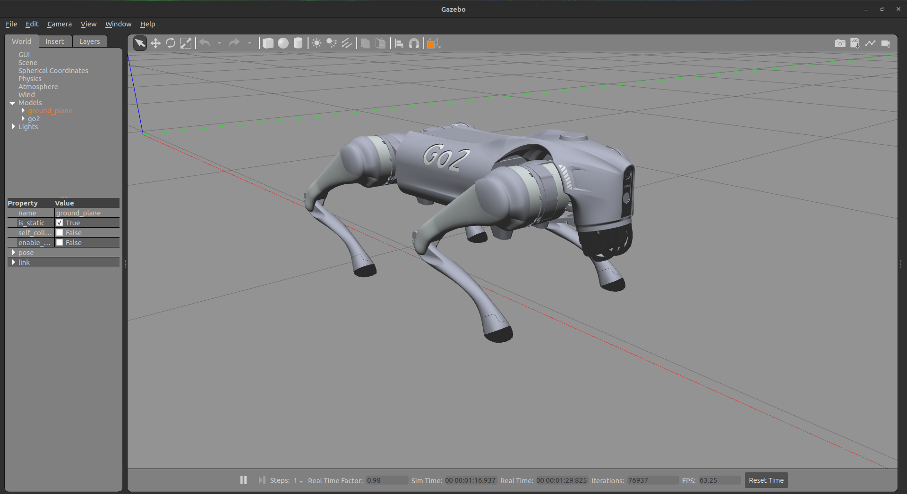
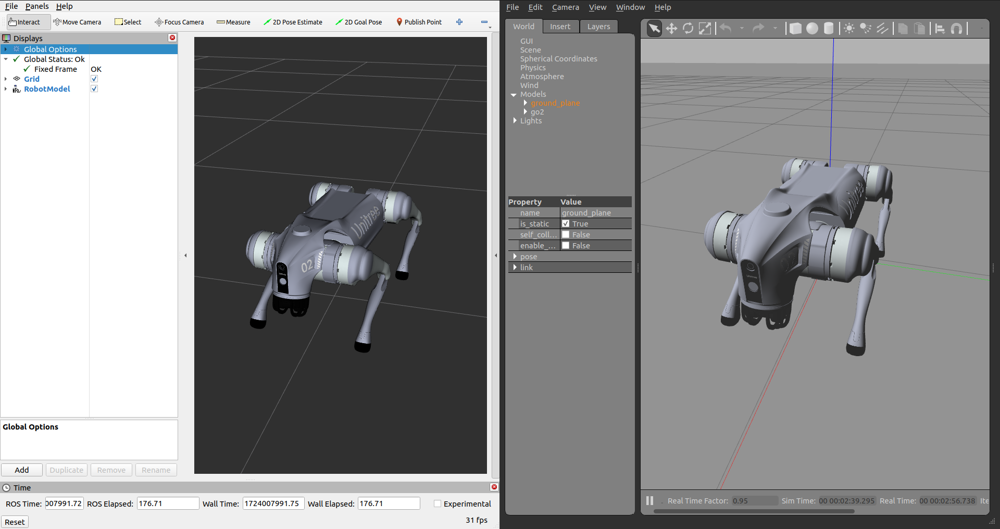
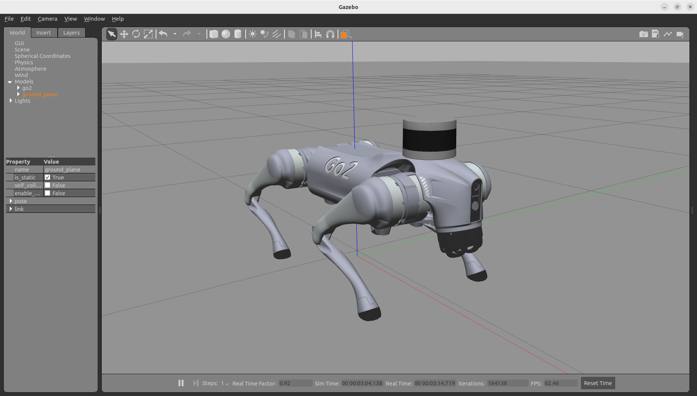
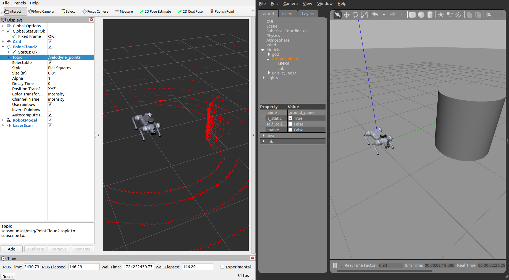

# unitree go2 ros2 — champ 配置

> 本包包含 Unitree Go2 机器人在 ROS 2 (Humble) 中集成 CHAMP 控制器的配置文件，包含配置包开发以及适配 ROS 2 Humble 发行版的机器人描述模型升级。

## Unitree Go2：
<div style="display: flex; gap: 50px;">
  
   
</div>

> 宇树科技（Unitree Robotics）专注于消费级和工业级高性能通用足式机器人、人形机器人以及六轴机械臂等的研发、生产和销售。公司高度重视自主研发和技术创新，全面自研机器人关键核心部件，包括电机、减速器、控制器、激光雷达以及高性能感知与运动控制算法，整合了完整的机器人产业链。

## CHAMP 控制器：


> CHAMP 是一个开源开发框架，用于构建新型四足机器人和开发新的控制算法。其控制框架基于 [*"基于模式调制与阻抗控制的层次化高动态运动控制器：在 MIT Cheetah 机器人上的实现"*](https://dspace.mit.edu/handle/1721.1/85490)。

## 参考资源：
- [go2 描述（URDF 模型）](https://github.com/unitreerobotics/unitree_ros/tree/master/robots/go2_description) 
- [champ 机器人（配置）](https://github.com/chvmp/robots)
- [champ 控制器](https://github.com/chvmp/champ)

## 已测试环境：
- Ubuntu 22.04 (ROS2 Humble)

## 当前包开发状态：

- &check; 已配置 go2 机器人 champ 参数
- &check; 机器人配置
    - &check; 机器人描述包已移植到 ROS 2
    - &check; 机器人 URDF 已移植到 ROS2（新增 ros2_control 标签）
    - &check; 机器人参数配置已移植到 ROS2
    - &check; 机器人启动文件已移植到 ROS2
- &check; 已升级 go2 描述模型以适配 ROS2 Humble
- &check; 已在 Gazebo 环境中生成 go2
- &check; RViz 纯演示可正常运行
- &check; Gazebo + 遥控机器人可正常运行
- &check; 已添加 IMU 和 2D 激光雷达
- &check; 已添加 3D 激光雷达（Velodyne）
- &check; 本仓库已通过外层 `LIO-SAM` 包完成 Gazebo 建图与地图保存
- &check; 本仓库已通过外层 `go2_behaviors` 包完成常用仿真动作
- &cross; Nav2 参数尚未完成调优，不能视为开箱即用

## 1. 安装

### 1.0 安装 ROS 相关依赖：
```bash
sudo apt install ros-humble-gazebo-ros2-control
sudo apt install ros-humble-xacro
sudo apt install ros-humble-robot-localization
sudo apt install ros-humble-ros2-controllers
sudo apt install ros-humble-ros2-control
sudo apt install ros-humble-velodyne
sudo apt install ros-humble-velodyne-gazebo-plugins
sudo apt-get install ros-humble-velodyne-description
```

### 1.1 克隆仓库并安装所有依赖：
    
```bash
sudo apt install -y python3-rosdep
rosdep update

cd <你的工作空间>/src
git clone https://github.com/anujjain-dev/unitree-go2-ros2.git
cd <你的工作空间>
rosdep install --from-paths src --ignore-src -r -y
```

### 1.2 构建工作空间：
```bash
cd <你的工作空间>
colcon build
. <你的工作空间>/install/setup.bash
```

## 2. 快速开始

无需实体机器人即可运行以下演示。请确保你的 ROS2 环境中已安装 ros2_control、Gazebo ROS 和 controller_manager 相关包。

### 2.1 Gazebo 演示：启动 Gazebo 环境
```bash
ros2 launch go2_config gazebo.launch.py
```


### 2.2 RViz 行走演示：同时启动 Gazebo 和 RViz
```bash
ros2 launch go2_config gazebo.launch.py rviz:=true
```


### 2.3 运行遥控节点：
```bash
ros2 run teleop_twist_keyboard teleop_twist_keyboard
```
https://github.com/user-attachments/assets/bcfeec70-12c5-49b8-b7a7-da4fa9b6dea5

### 2.4 Go2 Velodyne 配置 Gazebo 演示：启动 Gazebo 环境
```bash
ros2 launch go2_config gazebo_velodyne.launch.py 
```


### 2.5 Go2 Velodyne 配置 RViz 行走/点云演示：同时启动 Gazebo 和 RViz
```bash
ros2 launch go2_config gazebo_velodyne.launch.py rviz:=true
```

> 注意：将点云话题设置为 `/velodyne_points`



### 2.6 Go2 Hokuyo 2D 激光雷达配置 Gazebo 演示：

> 注意：如需使用 2D 激光雷达替代 3D Velodyne 激光雷达，请在 `robots/description/go2_description/xacro/` 目录下的 `robot_VLP.xacro` 文件中注释 `<xacro:include filename="$(find go2_description)/xacro/velodyne.xacro"/>` 并取消注释 `<xacro:include filename="$(find go2_description)/xacro/laser.xacro"/>`。

```bash
ros2 launch go2_config gazebo_velodyne.launch.py 
```

同时启动 Gazebo 和 RViz：
```bash
ros2 launch go2_config gazebo_velodyne.launch.py rviz:=true
```

### 2.7 执行 Gazebo 仿真动作

动作包位于同一 `simdog` 工作空间的 `src/go2_behaviors/`，复用当前
`joint_trajectory_controller`。先启动 2.5 节的完整 Gazebo，再在新终端执行：

```bash
ros2 run go2_behaviors go2_behavior hello
ros2 run go2_behaviors go2_behavior nod
ros2 run go2_behaviors go2_behavior stretch
ros2 run go2_behaviors go2_behavior wave
ros2 run go2_behaviors go2_behavior dance
ros2 run go2_behaviors go2_behavior lie
```

`lie` 会保持趴下并暂停 CHAMP，使用以下命令恢复：

```bash
ros2 run go2_behaviors go2_behavior stand
```

这些动作只适配当前 Gazebo 模型，不是 Unitree 真机 Sport API。

## 3. 步态参数调优

机器人的步态配置文件位于 `<机器人配置包>/gait/gait.yaml`。


- **膝关节朝向（Knee Orientation）** — 膝关节弯曲方向。可配置以下朝向模式：`.>>` `.><` `.<<` `.<>`，其中点表示机器人前方。

- **最大线速度 X（Max Linear Velocity X）**（米/秒）— 机器人前后移动的最大速度。

- **最大线速度 Y（Max Linear Velocity Y）**（米/秒）— 机器人横向移动的最大速度。

- **最大角速度 Z（Max Angular Velocity Z）**（弧度/秒）— 机器人旋转的最大速度。

- **支撑相时长（Stance Duration）**（秒）— 行走时每条腿着地的时长。如果不确定，可设为默认值 0.25。支撑相时长越大，足端离参考点的位移越大。

- **摆动相抬腿高度（Leg Swing Height）**（米）— 摆动相期间的轨迹高度。

- **支撑相压腿深度（Leg Stance Height）**（米）— 支撑相期间的轨迹深度。

- **机器人行走高度（Robot Walking Height）**（米）— 行走时髋关节到地面的距离。注意：该参数设置过高可能导致机器人不稳定。

- **质心 X 偏移（CoM X Translation）**（米）— 沿 X 轴移动参考点。当质心不在机器人中心（前髋到后髋之间）时，用于补偿重量分布。例如，如果机器人后部较重，则设为负值将参考点后移。

- **里程计比例因子（Odometry Scaler）** — 作为推算定位速度的乘数，用于补偿开环系统的里程计误差。通常取值范围为 1.0 到 1.20。

## 参与贡献

欢迎贡献！请随时提交 Pull Request。

1. Fork 本仓库
2. 创建你的特性分支（`git checkout -b feature/AmazingFeature`）
3. 提交你的修改（`git commit -m 'feat: 添加某某特性'`）
4. 推送到分支（`git push origin feature/AmazingFeature`）
5. 发起 Pull Request

## 致谢

本项目基于并整合了以下项目的成果：

* [Unitree Robotics](https://github.com/unitreerobotics/unitree_ros) — 提供 Go2 机器人描述（URDF 模型）
* [CHAMP](https://github.com/chvmp/champ) — 提供四足控制器框架
* [CHAMP Robots](https://github.com/chvmp/robots) — 提供机器人配置和搭建示例

我们衷心感谢以上项目的开发者和贡献者的宝贵工作。
