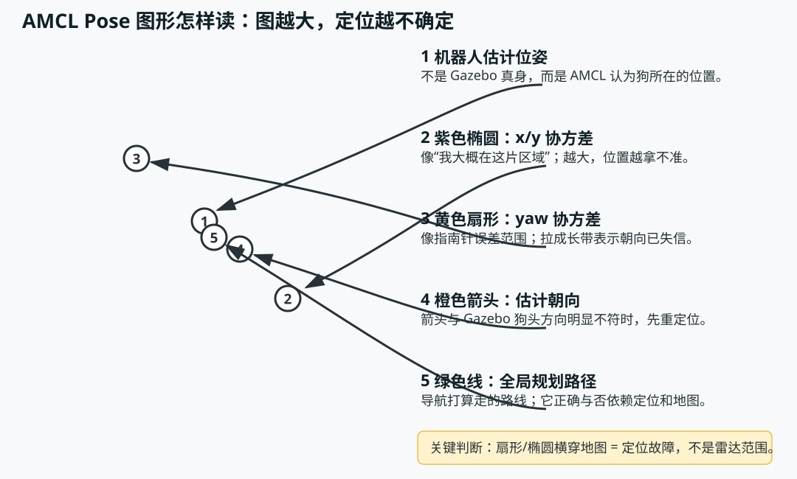
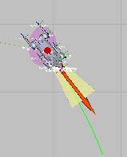
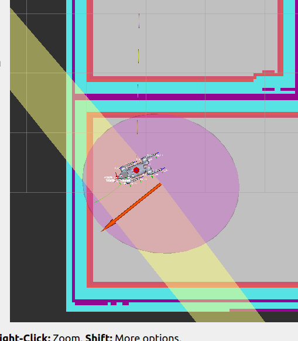
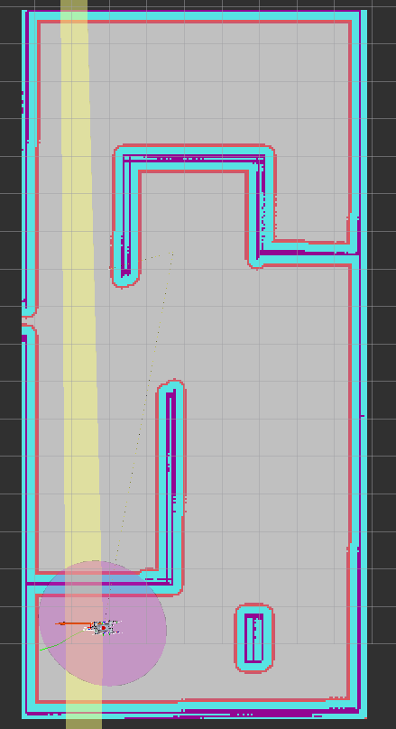
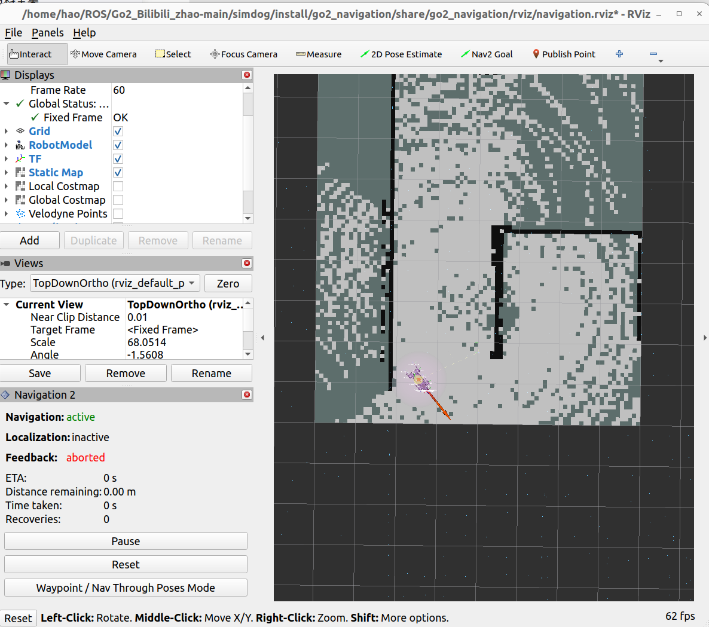
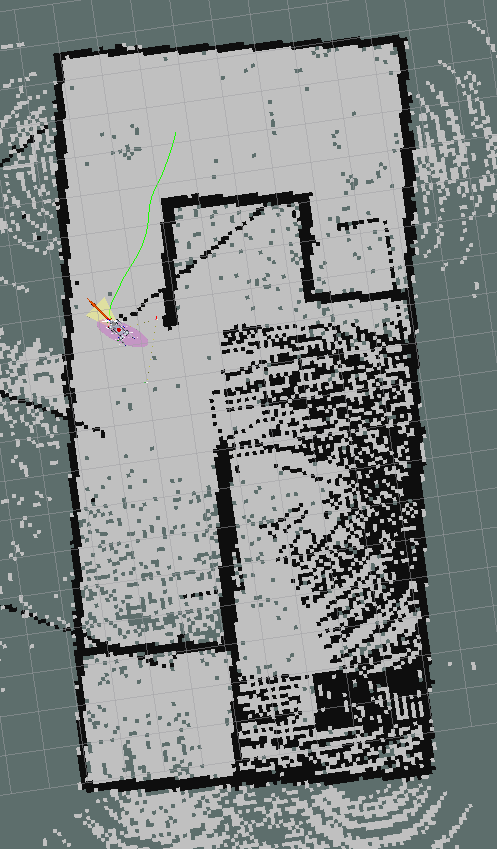
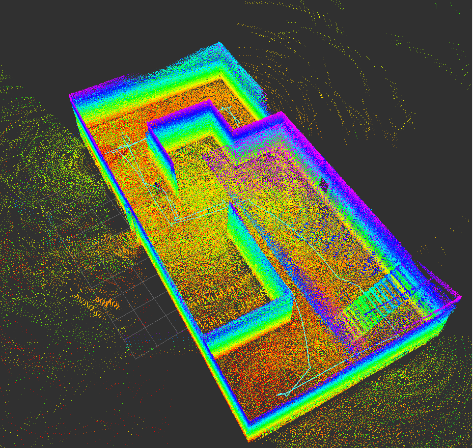
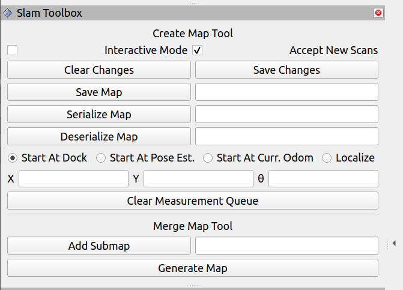
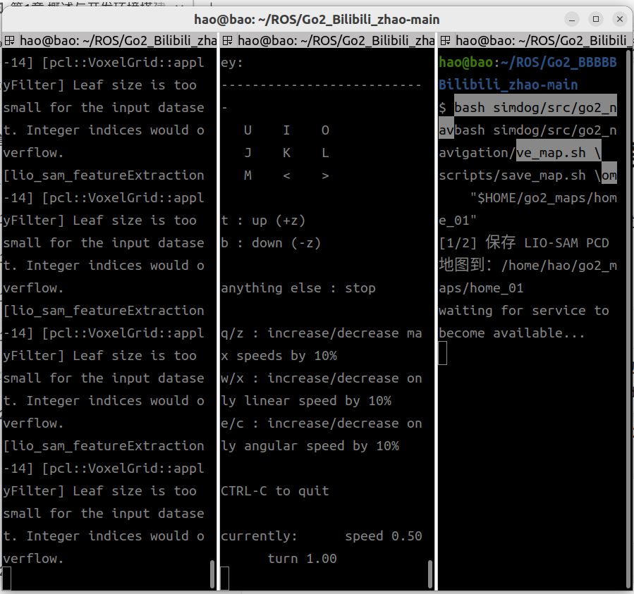
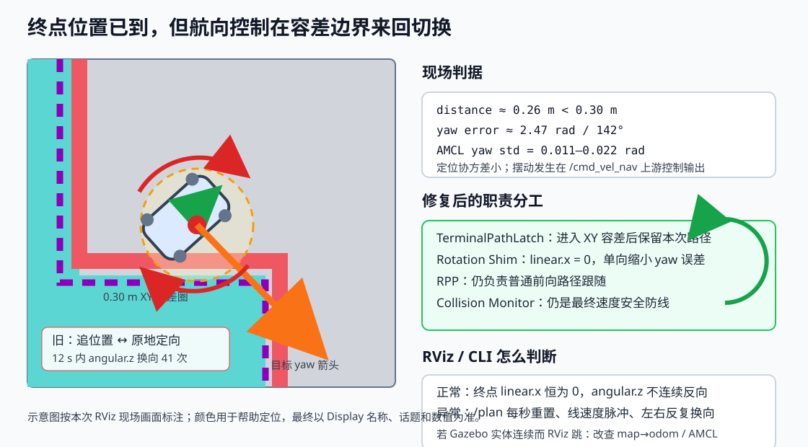

# Go2 导航、建图与 RViz 初学者图解手册

> 最后更新：2026-08-13
> 适用环境：Ubuntu 22.04、ROS 2 Humble、Gazebo Classic 11、Nav2、CHAMP 以及本仓库 `simdog/` 工作空间。
> 文档目标：看到一个名词、颜色、箭头或状态时，能够回答“它是什么、来自哪里、正常应怎样、异常该查什么”。

## 1. 先建立一张总图

可以把整套系统想象成一个人在陌生房间里行走：

- **传感器**是眼睛和内耳：Velodyne 看四周，D435 看近处，IMU 感知转动和倾斜。
- **里程计 odom** 是“闭着眼数步数”：短时间连续，但走久可能累计误差。
- **SLAM/AMCL/NDT** 是“拿环境特征对地图”：纠正数步数产生的误差。
- **地图**是房屋平面图；**代价地图**是在平面图上再画一圈“不要贴太近”的警戒带。
- **规划器**像导航软件，选择从当前位置到目标点的路线。
- **控制器**像司机，把路线变成前进和转向速度。
- **Collision Monitor** 像最后一道自动刹车，任何上游命令都必须经过它。
- **Gazebo** 是实际发生物理运动的虚拟世界；**RViz** 是读取 ROS 数据后画出的仪表盘。

本项目默认导航数据链如下：

```text
Gazebo 中的 Go2 与传感器
        │
        ├─ /velodyne_points ─ pointcloud_to_laserscan ─ /scan
        ├─ /depth/color/points
        ├─ /imu/data
        └─ /odom/ground_truth ─ go2_simulation_odom ─ /odom + odom→base_footprint
                                                        │
在线建图：slam_toolbox ───────────── map→odom + /map ────┤
固定地图：map_server + AMCL ───────── map→odom + /map ───┤
                                                        ▼
目标 → goal_guard → Nav2 规划器 → 控制器 → twist_mux
   → velocity_smoother → collision_monitor → /cmd_vel → CHAMP → 四条腿
```

最重要的排障顺序是：

```text
传感器有没有数据
  → TF 是否完整且只有一个发布者
  → 地图是否正确
  → 定位是否可信
  → 路径是否生成
  → 速度是否连续穿过安全链
  → Gazebo 中实体是否真的运动
```

不要一看到狗不动就先改目标容差，也不要一看到 RViz 跳动就先改控制器。上游定位错误时，控制器越努力，实体动作反而越奇怪。

## 2. Gazebo 和 RViz 到底有什么区别

| 名词 | 实际含义 | 初学者比喻 | 本项目中怎么看 |
|---|---|---|---|
| Gazebo | 带重力、碰撞、关节和传感器的物理仿真器 | 虚拟试验场 | 狗是否真的迈腿、碰墙、摔倒，以 Gazebo 为准 |
| RViz2 | ROS 数据可视化工具，本身不计算物理 | 汽车仪表盘和地图屏幕 | 地图、TF、路径、点云、定位估计都在这里显示 |
| Gazebo GUI | `gzclient` 图形窗口 | 试验场的监控摄像头 | 本项目导航/建图入口默认开启；性能测试可用 `gui:=false` |
| `gzserver` | Gazebo 仿真和物理计算后端 | 试验场本身 | 没有 GUI 时它仍可运行 |
| Fixed Frame | RViz 所有图形共同参考的坐标系 | 把所有透明胶片对齐所用的底板 | 导航必须用 `map`，不要随意改成 `odom` |

判断“跳”的来源：

- **只有 RViz 中的狗跳，Gazebo 实体位置连续**：优先检查定位、`map -> odom` 和 TF。
- **Gazebo 实体也左右乱走**：检查错误定位是否仍允许 Nav2 输出速度，以及 `/cmd_vel` 是否有多个发布者。
- **两边都卡顿但没有位置突变**：检查 CPU 负载、Gazebo real-time factor、传感器频率。

## 3. 读懂这次 RViz 截图

### 3.1 黄色扇形和紫色椭圆



上图来自本次真实运行截图。这里的图形属于 RViz 的 `PoseWithCovariance` 显示，订阅 `/amcl_pose`。

| 画面元素 | 具体数据 | 正常含义 | 异常含义 |
|---|---|---|---|
| 紫色椭圆 | 6×6 pose covariance 中 x/y 的方差 | AMCL 认为位置落在一个较小范围内 | 椭圆变大表示位置越来越拿不准 |
| 黄色扇形/梯形/长带 | yaw 方差 | AMCL 认为朝向只在一个小角度内波动 | 横穿地图表示航向几乎失去判断能力 |
| 橙色箭头 | 估计位姿的朝向 | 应与 Gazebo 中狗头方向基本一致 | 指向错误会让规划和控制建立在错误朝向上 |
| 绿色曲线 | `Raw Global Plan=/plan` | 规划器刚算出的路线 | 路径起点随定位跳动时，根因通常在定位上游 |
| 蓝色曲线 | `Controller Path (Smoothed)=/received_global_plan` | 实际交给控制器的路线；平滑失败时会安全回退为原始路线 | 会随机器人前进裁掉已走部分，不是路径丢失 |

**协方差 covariance** 不是“误差本身”，而是算法对自己不确定程度的估计。可以把它理解为天气预报的降雨范围：范围越大，不代表一定在边缘下雨，而是预报员越拿不准。

方差的单位不直观，所以实际排障使用标准差：

```text
标准差 = sqrt(方差)
```

本次现场读到：

```text
std(x)   ≈ 0.99 m
std(y)   ≈ 1.31 m
std(yaw) ≈ 1.72 rad ≈ 99°
```

这等于 AMCL 在说：“我连狗朝哪边都基本不知道。”这不是雷达视野，也不是速度死区。



上图中的扇形和椭圆比较小，表示相对更有把握。注意“小”不自动等于“绝对正确”；还要确认机器人模型与 Gazebo 实体处在同一个真实位置和朝向。



上图中紫色椭圆和黄色长带已经明显扩大。本项目安全监督当前采用带滞回的宽松联调阈值：

- 位置标准差超过 `0.75 m`，或 yaw 标准差超过 `0.75 rad`：锁速并拒绝新目标。
- 回落到位置 `0.55 m` 且 yaw `0.50 rad` 以内：才恢复可信。



上图黄色长带贯穿整张地图，是典型的 AMCL 航向失信。它看起来像一束探照灯，但实际不是任何传感器光束。

遇到这种画面时：

```bash
# 1. 先保证不再执行旧目标
ros2 service call /navigation/stop std_srvs/srv/Trigger "{}"

# 2. 查看实际协方差
ros2 topic echo --once /amcl_pose

# 3. 在 RViz 使用 2D Pose Estimate 重新给出真实位置和狗头朝向

# 4. 健康后再解除人工锁；旧目标不会自动恢复
ros2 service call /navigation/resume std_srvs/srv/Trigger "{}"
```

### 3.2 一张完整的固定地图导航窗口



这张截图需要逐块理解：

| 位置/文字 | 含义 | 这张图反映什么 |
|---|---|---|
| `Fixed Frame: OK` | RViz 能用固定坐标系变换画图 | 只说明当前所需 TF 可查询，不代表定位一定准确 |
| `Static Map` | `map_server` 发布的 `/map` | 固定地图不会随机器人继续扩展 |
| `Navigation: active` | Nav2 导航生命周期节点处于 active | 导航服务器已启动，不等于当前目标一定能成功 |
| `Localization: inactive` | RViz 未看到定位生命周期管理器处于 active | 固定 AMCL 模式下是不正常项；在线 SLAM 模式则不应拿它判断 Slam Toolbox |
| `Feedback: aborted` | 最近一次 NavigateToPose action 失败终止 | 需要看日志中的具体失败原因，不能仅凭 `aborted` 猜参数 |
| `Distance remaining: 0.00 m` | 当前没有有效剩余路径，或 action 已结束 | `aborted` 后为零不等于到达成功 |
| 地图外深灰区 | OccupancyGrid 未知/地图外区域 | 固定图不能在这里安全选目标 |
| 白/浅灰区域 | 地图中的自由栅格 | 候选目标仍要满足障碍余量 |
| 黑色像素 | 被地图判为占用的栅格 | 连续墙线通常合理，空地孤立点通常是噪声 |

**Navigation 2 面板状态不是总健康结论。** 在线 `online_slam` 模式由 Slam Toolbox 负责定位和建图，Nav2 面板可能显示 `Localization: inactive`，这不等价于 SLAM 故障。固定 `static_map + amcl` 模式下，`Localization: active` 才是预期状态。

### 3.3 为什么固定地图只能在已有范围里选目标

`map_server` 像把一张已经打印好的纸质平面图摊在桌上。机器人后来看到的新房间不会自动印到这张纸上。Velodyne、D435、Local Costmap 即使都有数据，也不会让静态 `/map` 变大。

- 想边走边扩图：使用 `navigation_mode:=online_slam`。
- 想在已经保存的图上稳定导航：使用 `navigation_mode:=static_map localization:=amcl`。
- 地图外目标被拒绝是安全门禁的预期行为，不是 RViz 鼠标坏了。

### 3.4 为什么会“又看到以前那张图”

固定地图模式不会自动判断哪张图质量最好，它只按启动参数 `map_dir` 找
`map.yaml`，再由 `map.yaml` 读取同目录的 `map.pgm`。这就像给打印机明确指定了
一份文件：指定旧文件，它就会忠实打印旧内容。

当前电脑上的目录必须这样区分：

| 目录 | 当前含义 | 固定 AMCL 是否推荐 |
|---|---|---|
| `~/go2_maps/home_01` | LIO-SAM 三维 PCD 投影出的旧二维图，范围过大且伪障碍多 | 否 |
| `~/go2_maps/latest` | LIO-SAM/NDT 地图流程使用的目录 | 不作为 AMCL 默认图 |
| `~/go2_maps/online/home_02` | 2026-08-12 保存的 Slam Toolbox 二维会话 | 是，当前可复现会话 |
| `~/go2_maps/online/latest` | `save_online_map.sh` 更新的软链接，指向最近保存的在线会话 | 是，日常推荐 |

固定地图推荐命令：

```bash
ros2 launch go2_navigation simulation_navigation.launch.xml \
    navigation_mode:=static_map localization:=amcl \
    map_dir:=$HOME/go2_maps/online/latest gui:=true rviz:=true
```

启动后不要只凭 RViz 画面猜测，直接查询 `map_server` 实际读取的文件：

```bash
ros2 param get /map_server yaml_filename
```

当前预期路径应解析到 `~/go2_maps/online/home_02/map.yaml`。如果参数正确但 RViz
仍保留旧画面，通常是旧 RViz 尚未退出，或新的 `map_server` 已经掉线而 RViz 仍显示
最后一次收到的地图。先关闭所有旧导航/RViz 终端，只启动一套入口，再检查：

```bash
ros2 lifecycle get /map_server
ros2 topic info -v /map
```

`map_server` 应为 `active [3]`，`/map` 应只有当前 `map_server` 发布。RViz 默认关闭
`Velodyne Points`、`Global Costmap` 和 `Local Costmap`；按需勾选这些动态层后看到的
散点或膨胀色块不是静态 `map.pgm` 本身。判断底图是否有噪声，应直接查看对应
`map.pgm`，或只保留 `Static Map` Display。

在线模式的 `map_session:=new` 含义不同：它创建空白 pose graph，不会加载上述任意
旧地图；只有显式传入会话目录时才会续建：

```bash
# 从空图重新探索
ros2 launch go2_navigation simulation_navigation.launch.xml \
    navigation_mode:=online_slam map_session:=new gui:=true rviz:=true

# 续建最近一次在线会话
ros2 launch go2_navigation simulation_navigation.launch.xml \
    navigation_mode:=online_slam \
    map_session:=$HOME/go2_maps/online/latest gui:=true rviz:=true
```

## 4. 读懂地图、点云和黑色散点

### 4.1 二维栅格地图 OccupancyGrid

二维地图是规则小格组成的棋盘，每格保存“被占用的可能性”：

| 常见显示 | 栅格语义 | 比喻 |
|---|---|---|
| 白色/浅灰 | free，自由空间 | 已确认可以放脚的地板 |
| 黑色 | occupied，占用 | 墙、家具或被误判为障碍的噪点 |
| 灰色 | unknown，未知 | 还没看过，不能当作必然安全 |



这张图里连续、笔直的黑线像墙，基本合理；房间内部大量孤立黑点和右侧密集“芝麻点”不合理。它们会造成三个连锁问题：

1. 目标门禁认为许多空地不可用。
2. 全局规划器绕来绕去，甚至找不到路径。
3. 激光实时观测与错误地图不匹配，AMCL 粒子分散并可能跳到另一处相似结构。

本次旧 `home_01` 图来自三维 LIO-SAM PCD 的简单二维投影：地面、墙面、家具和不同高度的点挤进同一格，再加上远处离群点，形成大量假障碍。它不再作为 AMCL 默认地图。AMCL 推荐使用 Slam Toolbox 根据同一 `/scan` 原生生成的 `map.yaml + map.pgm`。

### 4.2 三维点云 PCD



这张彩色图是三维点云，不是二维导航地图：

- 每个彩色点都有 x/y/z，高处墙面、低处地面和家具可以同时存在。
- 颜色通常由高度、强度或显示器的颜色变换产生；它不自动表示“红色危险、蓝色安全”。
- 点云看起来轮廓漂亮，不代表直接压扁成二维图就适合 AMCL。

比喻：三维 PCD 像一栋房子的立体扫描模型；二维 OccupancyGrid 像消防疏散平面图。把立体模型里所有楼层和天花板直接压到一张纸上，平面图自然会布满黑点。

| 地图文件 | 内容 | 主要消费者 | 能否直接互换 |
|---|---|---|---|
| `map.pgm` | 二维灰度栅格图片 | `map_server`、AMCL、Nav2 | 不能替代 PCD |
| `map.yaml` | PGM 路径、分辨率、原点和阈值 | `map_server` | 与对应 PGM 配套 |
| `slam.posegraph` | Slam Toolbox 位姿图 | Slam Toolbox 续建/定位 | 不是给 AMCL 直接读取的图片 |
| `slam.data` | Slam Toolbox 序列化传感器/图数据 | Slam Toolbox | 与 posegraph 配套 |
| `GlobalMap.pcd` | 三维点集合 | NDT/GICP、点云查看 | 不能直接当二维栅格 |
| `map_bundle.yaml` | PCD/PGM/YAML 同源性与哈希清单 | NDT 实验档门禁 | AMCL 原生二维图不要求它 |

### 4.3 地图、定位地图和代价地图不要混淆

| 名词 | 会不会随观测变化 | 作用 |
|---|---|---|
| Static Map | 不会 | 保存好的长期二维环境 |
| Live SLAM Map | 会扩展/修正 | 正在学习中的二维环境 |
| Localization Map `/global_map` | 通常固定 | NDT 用来对齐实时三维点云的 PCD |
| Global Costmap | 动态更新 | 在整张任务区域叠加实时障碍和膨胀代价 |
| Local Costmap | 动态滚动 | 机器人附近短距离避障窗口 |

## 5. Slam Toolbox 面板图解



| 控件 | 实际作用 | 使用建议 |
|---|---|---|
| `Interactive Mode` | 允许交互式调整图优化约束 | 初学阶段保持默认，避免误拖子图 |
| `Accept New Scans` | 是否接收新激光并继续建图 | 建图时必须允许 |
| `Clear Changes` | 清除尚未保存的交互修改 | 不是“清空整张地图”按钮 |
| `Save Changes` | 保存交互修改 | 仅在明确做过图编辑时用 |
| `Save Map` | 保存二维栅格 | 项目更推荐统一保存脚本，避免漏掉 pose graph |
| `Serialize Map` | 保存可续建的 pose graph/data | 续建需要它，不只是 PGM/YAML |
| `Deserialize Map` | 加载序列化会话 | 用于继续已有会话 |
| `Start At Dock` | 从记录的 dock 位姿开始 | 有可靠 dock 定义时用 |
| `Start At Pose Est.` | 从给定 x/y/θ 开始 | 已知地图内初始位姿时用 |
| `Start At Curr. Odom` | 用当前 odom 作为起点 | 续建且 odom 原点关系明确时用 |
| `Localize` | 加载地图后只定位 | 不再扩图的 Slam Toolbox 定位档 |
| `Clear Measurement Queue` | 清掉等待处理的激光 | 传感器队列积压或恢复联调时使用 |
| `Add Submap / Generate Map` | 合并或生成地图 | 高级多会话流程，普通采图暂不使用 |

项目保存命令：

```bash
bash simdog/src/go2_navigation/scripts/save_online_map.sh learning_room
```



终端中 `waiting for service to become available...` 表示脚本正在等待保存服务被 ROS 发现，不等于保存已经成功。必须等它继续输出成功路径和文件，再关闭建图节点。

## 6. ROS 2 基础名词

| 名词 | 含义 | 本项目例子 |
|---|---|---|
| ROS graph | 当前所有节点、话题、服务和 action 的连接关系 | `ros2 node list`、`ros2 topic list` |
| Node 节点 | 一个长期运行、完成单一职责的进程/组件 | `/amcl`、`/controller_server` |
| Topic 话题 | 连续广播数据，发布者不等待接收者答复 | `/scan`、`/odom`、`/cmd_vel` |
| Publisher | 向话题发布消息的一方 | Collision Monitor 发布最终 `/cmd_vel` |
| Subscriber | 订阅话题的一方 | AMCL 订阅 `/scan` |
| Service | 一次请求、一次回复的短操作 | `/navigation/stop` |
| Action | 可持续数秒/分钟、带反馈且可取消的任务 | `/navigate_to_pose` |
| Parameter | 节点启动或运行参数 | `controller_frequency=10.0` |
| Launch | 一次启动一组节点和参数 | `simulation_navigation.launch.xml` |
| Lifecycle | 节点的 unconfigured/inactive/active/finalized 状态机 | `map_server`、AMCL、Nav2 节点 |
| QoS | 话题可靠性、缓存和历史策略 | 激光常用 Best Effort，地图常用 Transient Local |
| DDS | ROS 2 底层发现和传输机制 | 本项目使用 CycloneDDS |
| ROS_DOMAIN_ID | 隔离 ROS 图的域编号 | 不同域的节点彼此看不见 |
| Remap | 不改源码，把话题/服务/action 名接到另一名字 | 键盘 `cmd_vel` 重映射到 `/cmd_vel_teleop` |
| Namespace | 给一组名称加前缀，避免冲突 | 本项目主要使用根命名空间 `/` |

三个通信概念的比喻：

- Topic 像广播电台：持续播，没人听也可以播。
- Service 像柜台办事：问一次，答一次。
- Action 像叫车订单：下单后持续看到进度，可以中途取消，最后得到成功/失败结果。

常见 QoS：

- **Reliable**：尽量确保收到，像挂号信；适合地图和控制状态。
- **Best Effort**：来不及就丢旧帧，像直播；适合高频激光，宁愿要新帧也不积压。
- **Transient Local**：新订阅者上线也能拿到最后一份数据；适合静态地图和最后一次 AMCL 位姿。

## 7. TF 和坐标系

**TF** 是“不同尺子之间的换算关系”。机器人身上每个传感器都有自己的坐标尺；TF 让系统知道一个激光点换算到地图上在哪里。

本项目导航主链：

```text
map → odom → base_footprint → base_link → velodyne / d435 / imu / 各腿关节
```

| Frame | 含义 | 是否应随步态上下振动 |
|---|---|---|
| `map` | 长期全局地图坐标系 | 否 |
| `odom` | 连续局部里程计坐标系 | 原点固定，机器人在其中连续移动 |
| `base_footprint` | 机器人投影到地面的二维底盘中心 | z/roll/pitch 在二维导航中应为零 |
| `base_link` | 真实机身中心 | 会随四足步态升降、俯仰和横滚 |
| `velodyne` | VLP-16 光心 | 通过固定外参连接 base_link |
| `d435_*` | 深度相机及光学坐标系 | 光学 frame 的轴约定与机身 frame 不同 |
| `imu_link` | IMU 坐标系 | 用于解释角速度、加速度和姿态 |

### `map -> odom` 为什么最关键

`odom` 保证短期连续，定位算法计算 `map -> odom` 来纠正累计偏差。它像“地图北”和“你数步数的临时坐标”之间的校准旋钮。

- 在线模式：只能由 `slam_toolbox` 发布。
- 固定 AMCL：只能由 `amcl` 发布。
- NDT 实验档：NDT pose 进入二维全局 EKF，由 EKF 发布。
- 同时有两个发布者会互相抢校准旋钮，画面必然跳。

常用检查：

```bash
ros2 run tf2_ros tf2_echo map odom
ros2 run tf2_ros tf2_echo odom base_footprint
ros2 run tf2_ros tf2_echo base_footprint base_link
ros2 topic info /tf --verbose
```

| TF 现象 | 通常原因 |
|---|---|
| RViz 红色 `No transform` | 某段 TF 缺失、时间戳不一致或节点未启动 |
| `map -> odom` 突然大跳 | AMCL/NDT 失配或多个发布者竞争 |
| `odom -> base_footprint` 断流 | 里程计适配器停止或仿真时间卡住 |
| 地图、激光、机器人彼此错位 | frame_id、外参、时间或定位错误 |

## 8. 传感器与数据类型

| 名词 | 具体含义 | 本项目话题 |
|---|---|---|
| Velodyne VLP-16 | 16 线三维旋转激光雷达 | `/velodyne_points` |
| PointCloud2 | 带 x/y/z 等字段的三维点集合 | `/velodyne_points`、`/depth/color/points` |
| LaserScan | 按角度排列的一圈二维距离 | `/scan` |
| `pointcloud_to_laserscan` | 从 VLP-16 水平高度切片生成二维扫描 | 输入点云，输出 `/scan` |
| RealSense D435 | RGB-D 深度相机 | `/depth/color/points` 等 |
| IMU | 加速度计和陀螺仪 | `/imu/data` |
| JointState | 关节位置、速度、力 | `/joint_states` |
| Odometry | 位姿和速度的局部连续估计 | `/odom` |
| Ground truth | 仿真引擎直接给出的真值 | `/odom/ground_truth`，只用于仿真闭环基准 |
| Hz | 每秒消息次数 | `/scan` 目标约 10 Hz，重负载下可能降低 |
| Latency | 数据从产生到消费的延迟 | 太大会让控制基于过时障碍和位姿 |
| Timeout | 多久没收到数据就判失效 | 传感器断开后安全锁速依据之一 |

`pointcloud_to_laserscan` 的高度过滤像从一叠立体 CT 切片里只抽取与雷达水平面接近的一层。切得太低会把地面当墙，切得太高会漏掉矮障碍，切得太厚会把多个高度压到同一二维方向。

```bash
ros2 topic hz /velodyne_points
ros2 topic hz /scan
ros2 topic hz /depth/color/points
ros2 topic echo --once /scan
```

## 9. 建图和定位算法名词

| 名词 | 解释 | 在本项目中的位置 |
|---|---|---|
| Mapping | 把传感器观测积累成地图 | Slam Toolbox 或 LIO-SAM |
| Localization | 已知地图时估计机器人位姿 | 固定图默认 AMCL |
| SLAM | 同时做定位与建图 | 在线模式使用 Slam Toolbox |
| Slam Toolbox | ROS 2 成熟二维激光 SLAM | 默认在线扩图 |
| LIO-SAM | LiDAR + IMU 的三维因子图 SLAM | 生成三维 PCD 实验地图 |
| Loop Closure | 认出“又回到了走过的地方”并整体校正地图 | 像把画歪的闭合路线重新扣上 |
| Scan Matching | 把当前激光形状与地图/前一帧对齐 | Slam Toolbox、AMCL、NDT 都涉及不同形式的匹配 |
| AMCL | 自适应蒙特卡洛定位，使用大量粒子表示可能位姿 | 固定二维图默认后端 |
| Particle | AMCL 的一个“机器人可能在这里”的假设 | 粒子聚成一团表示更确定 |
| Initial Pose | 给定位算法的初始大概位置和朝向 | RViz `2D Pose Estimate` 发布 `/initialpose` |
| NDT | 把点云空间划格并用概率分布做配准 | 三维固定地图实验后端 |
| GICP | 融合点到点/平面协方差的点云配准方法 | `lidar_localization_ros2` 可选方案 |
| Fitness | 点云配准误差/质量指标 | 通常越小越好，但阈值必须与实现和地图实测匹配 |
| Relocalization | 定位丢失后重新寻找全局位姿 | 不等于普通短期跟踪 |
| EKF | 扩展卡尔曼滤波器，融合连续运动和带噪观测 | NDT 实验档二维 `map -> odom` 平滑 |
| `two_d_mode` | 强制只估计 x/y/yaw | 防止机身步态 z/roll/pitch 污染二维全局 TF |
| Beam Skipping | AMCL 忽略少量与地图不一致的激光束 | 动态物体/孤立噪点不拖走整批粒子 |

AMCL 的粒子可以想成一群侦察员：每个侦察员猜一个位置，拿那里应该看到的墙与真实激光对比。匹配好的侦察员获得更多“后代”，匹配差的逐渐消失。如果地图有大量相似走廊或假黑点，侦察员可能分成几群，甚至集体跑到错误房间。

## 10. Nav2 规划与控制名词

| 名词 | 作用 | 本项目实现 |
|---|---|---|
| Nav2 / Navigation2 | ROS 2 导航框架总称 | 规划、控制、行为树、代价图和生命周期 |
| NavigateToPose | 从当前位姿导航到一个目标位姿的 action | 对外 `/navigate_to_pose` |
| Goal Guard | 目标门禁 | 检查地图、定位、目标安全后转发到底层 action |
| Accepted Goal | 已被目标门禁接受的原始 RViz 目标 | transient-local `/navigation/accepted_goal`，供诊断区分用户目标和路径末端 |
| Planner | 在地图上找一条可行路径 | `SmacPlanner2D` |
| Raw Global Plan | 规划器刚算出的整条路线 | RViz 绿色 `/plan` |
| Controller Path (Smoothed) | 实际交给控制器的路线；平滑失败时为原始路线 | RViz 蓝色 `/received_global_plan` |
| Controller | 根据当前位姿追踪路径并输出速度 | 默认 Rotation Shim，内部 RPP |
| Rotation Shim | 在路径初始朝向或终点朝向需要大转角时接管原地旋转 | 终点保持 `linear.x=0`，完成目标 yaw |
| Primary Controller | Rotation Shim 内部负责普通路径跟随的控制器 | `FollowPath.primary_controller=RPP` |
| RPP | Regulated Pure Pursuit，受约束纯追踪 | 前向优先，带碰撞预测 |
| Lookahead | 控制器在路径前方选择的追踪点/弧 | 太近易抖，太远易切弯 |
| SmoothPath | Nav2 行为树调用的路径平滑 action | 现在已接到每次全局计划后 |
| SimpleSmoother | 对折线点做快速平滑的 Nav2 插件 | 适合当前 SmacPlanner2D |
| MPPI | 基于采样预测的模型预测路径积分控制器 | `forward_mppi`/`omni_mppi` 对照档 |
| Behavior Tree / BT | 按条件组织规划、跟随、恢复和取消 | `bt_navigator` |
| Recovery | 主导航失败后的恢复行为 | 清图、旋转、后退、等待等 |
| Goal Checker | 判定是否已到目标 | 普通档 0.30 m / 0.15 rad |
| PoseProgressChecker | 判定平移或转向是否取得进展 | 0.10 m 或 0.15 rad 任一达到即刷新 |
| TerminalPathLatch | 进入终点 XY 容差后冻结当前目标的路径 | 防止 1 Hz `setPlan()` 重置 shim；新目标仍重规划 |
| Tolerance | 容许误差 | 不是越小越好；小于四足落足波动会在终点反复修正 |
| ETA | Estimated Time of Arrival，预计到达时间 | 只能作为估计，不是安全保证 |
| Feedback | action 执行中的进度信息 | executing、distance remaining 等 |
| Succeeded | action 成功到达 | 通过 goal checker |
| Canceled | 用户/系统取消 | 与失败不同 |
| Aborted | action 因规划、控制、进度或服务器故障终止 | 必须结合日志找具体原因 |
| Incomplete | 诊断采样结束时目标仍在执行或尚未进入终点 | 不是导航 action 失败；延长获取期限后复测 |

### 目标不是只有一个点

RViz `Nav2 Goal` 拖出的箭头同时包含：

- x/y：狗最后应该站在哪里。
- yaw：狗最后应该朝哪个方向。

只点击不正确拖方向，可能出现“位置到了但一直转”的现象。普通目标容差
`0.30 m / 0.15 rad` 表示允许站位约差 30 cm、方向约差 8.6°。

### `Failed to make progress`

它表示 progress checker 在限定时间内没有观察到足够位移，不等于唯一根因是“腿迈不动”。可能原因包括：

- 安全锁或 Collision Monitor 反复把速度归零。
- 定位跳变让控制器不断改方向。
- 路径被假障碍堵住。
- 仿真负载导致控制和传感器长时间断流。
- 速度低于四足接触模型能持续位移的下限。

### 10.1 案例：已经到目标附近，却为了最终朝向来回摆动

先确保安全：在 RViz 点 `Navigation 2 -> Cancel`；如果仍在摆动，调用
`/navigation/stop`，确认 `/cmd_vel` 已归零后再靠近机器人或修改参数。

肉眼现象如下图：机器人位置已经进入目标圆，但目标箭头要求它改变较大的最终朝向；
机身一会向左、一会向右，还夹带短促前进，始终不能稳定对准箭头。



2026-08-13 的现场证据把“定位不准”和“控制器切换”分开了：

```text
目标距离：约 0.26 m，已经进入 xy_goal_tolerance=0.30 m
剩余 yaw 误差：约 2.47 rad（142°）
12 秒 /cmd_vel_nav.angular.z 换向：41 次，并夹带非零 linear.x
AMCL yaw 标准差：0.011–0.022 rad（约 0.6–1.3°）
第二次采样：路径末端距目标约 0.298 m，12 秒收到 40 条 /plan
第二次采样：/cmd_vel_nav 最大 linear.x=0.163 m/s，换向 9 次
```

AMCL 当时对航向很有把握，Collision Monitor 也没有改写这段上游
`/cmd_vel_nav`，所以根因在控制状态机：Humble RPP 在 XY 容差边界直接切换
“继续追位置”和“停下对准目标 yaw”。四足原地踏步造成几厘米位置变化时，机器人会反复
跨过 `0.30 m` 边界，控制输出就像司机不断在“挪车”和“摆正车头”之间改主意。

本项目现在的数据链是：

```text
约 1 Hz ComputePathToPose + SmoothPath
        │
        ├─ GridBased.tolerance=0：不可达原始目标明确失败
        ├─ 新目标：必须先得到一条属于它的新路径
        ├─ 还没同时接近原始目标和路径末端：继续按周期规划
        └─ 两个距离都进入 0.30 m：TerminalPathLatch 保留当前目标路径
                                  │
                                  ▼
RotationShimController（外层）── 终点 linear.x=0，只对准目标 yaw
        │
        └─ primary_controller=RPP（普通路径仍由它前向跟随）
                                  │
                                  ▼
/cmd_vel_nav → twist_mux → velocity_smoother → collision_monitor → /cmd_vel
```

`TerminalPathLatch` 不是“永远记住到过终点”。它允许路径末端与目标有 `0.075 m` 的
栅格中心误差和 `0.01 rad` 的数值 yaw 误差，但 frame 必须一致；新目标即使 XY 相同而
yaw 不同，也必须先生成一条新路径。路径确属当前目标后，它查询实时
`map→base_footprint` TF，只有机器人到原始目标、到路径末端两个距离都进入 `0.30 m`
才锁存。锁存后定位短时漂出边界也不恢复规划；新目标、行为树 `halt()` 或 recovery 才
清除状态。TF 暂不可用且尚未锁存时会限频报警并继续规划，不会误用旧目标。

这里还有一个不直观的 BT 生命周期问题：旧节点在每次规划成功后调用 `resetChild()`，
等价于每次都把 `RateController` 的秒表拨回“首次运行”，所以名义 1 Hz 实际会变成每个
行为树周期都规划。新节点保留秒表状态；真实 `RateController` 自动化测试中连续快速
tick 10 次只执行 1 次规划。这样才真正避免 Humble Rotation Shim 每次 `setPlan()` 重置
内部终点位置检查器。

默认参数及物理意义：

| 参数 | 当前值 | 正常可见变化 | 过小/过大的表现 |
|---|---:|---|---|
| `rotate_to_goal_heading` | `true` | XY 到达后由 shim 完成目标 yaw | 关闭后又由内部 RPP 处理终点航向 |
| `closed_loop` | `false` | shim 按限加速度开环生成角速度 | 避免把 1 s 角速度滑窗误当低延迟反馈；目标姿态仍由 TF 闭环 |
| `rotate_to_heading_angular_vel` | `0.45 rad/s` | 保持单向、可持续原地转动 | 太小克服不了接触阻力，太大容易过冲 |
| `max_angular_accel` | `1.0 rad/s²` | 角速度平滑爬升/下降 | 太小响应慢，太大冲击明显 |
| `angular_dist_threshold` | `1.40 rad` | 接近侧后方路径时先原地对齐 | 太小会把普通弯道切成走走停停 |
| `angular_disengage_threshold` | `0.40 rad` | 低于此角差后退出路径初始对齐 | 设得接近进入阈值容易来回切换 |
| `forward_sampling_distance` | `0.50 m` | 用前方半米路径判断朝向 | 太短受局部折线影响，太长可能忽略近处弯道 |
| `simulate_ahead_time` | `1.0 s` | 旋转前预测碰撞 | 太短预见不足，太长可能在窄处过于保守 |

`general_goal_checker` 为 `0.30 m/0.15 rad`，`PoseProgressChecker`、速度平滑、RPP
碰撞预测和 Collision Monitor 都没有关闭。没有选择放宽 yaw、增加 BackUp 或取消碰撞保护，
因为这些做法只会掩盖状态反复切换。

先做纯旋转基线，这相当于“暂时把自动驾驶大脑拿掉，只检查方向盘、车轮和里程表”。在
RViz 点击 `Navigation 2 → Cancel`，确认 `/pause_navigation=false`，并保证四周至少
`0.8 m` 无障碍。两个终端分别执行：

```bash
# 终端 A：只读诊断，不会发布速度
ros2 run go2_navigation rotation_diagnostics \
  --mode manual --duration 10 --expected-wz 0.45

# 终端 B：通过完整安全链发纯旋转；不得直接发布 /cmd_vel
timeout 5 ros2 topic pub -r 20 /cmd_vel_teleop geometry_msgs/msg/Twist \
  "{linear: {x: 0.0, y: 0.0, z: 0.0}, angular: {x: 0.0, y: 0.0, z: 0.45}}"
```

依次测试 `±0.15、±0.25、±0.35、±0.45 rad/s`。`0.35/0.45` 两档应在左右两个方向都
达到至少 70% 执行增益；`/odom`、`odom→base_footprint` 与真值累计 yaw 相差不超过
`0.03 rad`。若这里失败，应停下 Nav2 参数调整，先修相应底层。

本机 2026-08-13 的结果正是这种“底层基线失败”：`/cmd_vel` 已准确收到
`±0.45 rad/s`，真值、`/odom` 和 TF 的 yaw 也互相吻合，但 Gazebo 实体对
`+0.45 rad/s` 只执行出约 `33%`，反向约 `94%`；折算每 90° 还分别漂移约
`0.38 m/0.13 m`。这说明“方向盘命令和里程表”没有断，而是四脚落足产生的实体转动
不对称。把脚底摩擦从 `0.6` 提到 `1.0` 没有改善，已恢复原值；下一步应针对 CHAMP
步态轨迹、左右落足和 Gazebo 接触逐项标定，而不是放宽 `yaw_goal_tolerance`。

分层 A/B 找到了一项明确改善：`stance_depth` 原来让支撑脚在步态轨迹中额外向下压
`0.01 m`，改成 `0.0 m` 后，正/反向变为约 `70%/61%`，漂移变为约
`0.11/0.06 m/90°`。可把它理解为“脚已经踩地后不再继续向地板里压一厘米”，侧滑因此
明显减少。这也是 CHAMP Go1 上游 gait 的常用基线，所以当前保留；但反向增益和正向漂移
仍略未达到门槛，不能写成 PASS。提高脚底摩擦、改成官方 Go1 PID、把支撑时长改成
`0.20/0.30 s` 或把抬脚高度改成 `0.05 m` 都没有同时改善两项指标，已全部撤回。

五层故障树：

```text
肉眼看见“踏步但方向不到位”
  ├─ /cmd_vel_nav 没有 wz：控制器/目标状态没有产生命令
  ├─ 上游有、/cmd_vel 没有：twist_mux/平滑/Collision Monitor 拦截
  ├─ /cmd_vel 有、Gazebo 机身不转：CHAMP gait、接触或摩擦问题
  ├─ 机身转、odom/TF 不转：里程计反馈链问题
  └─ 上述都正常、终点 /plan 仍以 1 Hz 更新：终点状态/锁存问题
```

导航模式 CLI 观察步骤：

```bash
# 1. 参数应回读出外层 shim、内部 RPP 和终点旋转设置
ros2 param get /controller_server FollowPath.plugin
ros2 param get /controller_server FollowPath.primary_controller
ros2 param get /controller_server FollowPath.rotate_to_goal_heading
ros2 param get /controller_server FollowPath.closed_loop

# 2. 发送目标前或导航途中启动；新目标会重新开始 120 s 获取计时
ros2 run go2_navigation rotation_diagnostics \
  --mode navigation --acquire-timeout 120 --duration 10 \
  --xy-tolerance 0.30 --yaw-tolerance 0.15

# 3. 需要保留原始证据时记录四级速度、规划、真值、里程计和 AMCL
ros2 bag record /plan /cmd_vel_teleop /cmd_vel_nav /cmd_vel_switched \
  /cmd_vel_smoothed /cmd_vel /odom/ground_truth /odom /tf /amcl_pose \
  /navigation/accepted_goal /pause_navigation

# 4. 区分实体真值移动与 AMCL 修正：两个 TF 都要看
ros2 run tf2_ros tf2_echo odom base_footprint
ros2 run tf2_ros tf2_echo map odom
```

正常表现是：进入终点定向后 `linear.x` 保持零，`angular.z` 只朝缩小 yaw 误差的方向，
`/plan` 不再每秒重置 FollowPath，最终 action 为 `SUCCEEDED`。异常表现包括：重新出现连续
正负换向、非零线速度脉冲、`Failed to make progress`、`BackUp`，或 Gazebo 实体不动而
`map -> odom` 明显跳变；最后一种属于定位链，不能再靠控制器参数补偿。

新诊断会分别打印三组距离，可以把问题像对账一样分开：机器人到原始目标超差说明最终
用户要求没满足；机器人到路径末端超差说明路径跟随/定位有问题；路径末端到原始目标超过
`0.075 m/0.01 rad` 说明规划结果不属于原始目标。`/navigation/accepted_goal` 使用
transient-local QoS，所以诊断稍晚启动也能读到最近一次已接受目标。

navigation 诊断里的 `--acquire-timeout` 是“最多等多久进入终点”，`--duration` 是“进入
终点后最多记录多久”，两者不要混为一谈。收到新目标时获取期限会重新开始；action 成功
后继续观察 1 秒再计算停稳误差。如果期限到时还在途中，输出 `INCOMPLETE` 和退出码 2，
不会拿途中 `5 m` 的距离去判定终点失败。多行 Bash 命令中的反斜杠 `\` 必须紧贴换行，
后面不能再留空格，否则下一行可能不会作为同一条命令执行。

现场曾出现“机器人→目标 `5.401 m`、路径末端→目标 `0.010 m`、`map→odom` 单步
`0.020 m/0.009 rad`”的输出：路径与用户目标吻合、定位也稳定，只是 30 秒结束时机器人
仍在途中。它应该归类为 `INCOMPLETE`，不能据此调整 AMCL 或终点控制器。

2026-08-13 的无界面同 XY `+90°` 实测得到：action `4.8 s` 成功，四级速度终点段
`linear.x=0`、`max|angular.z|=0.45 rad/s`、0 次换向，锁存后 `/plan=0`。这说明控制
状态机修复有效。可是同次 AMCL 出现 `0.414 m` 单步 `map→odom` 修正，停稳后机器人到
原始目标约 `1.23 m`；因此这次整体验收仍是 FAIL，失败层是地图/AMCL，而不是继续调整
Rotation Shim、RPP 或 GoalChecker。

当前实测边界必须区分：旧版锁存曾让连续两个同一 XY 的内部 `±90°` 目标成功，随后
`home_02` 的 AMCL 在原地转动中发生 `map→odom` 米级修正，精确 `180°` 目标未完成。
当前实时 TF 锁存、0.45 rad/s 和 `closed_loop=false` 已通过自动化测试；纯旋转双向
基线已实测但没有通过实体增益与漂移门槛，所以按规则没有继续运行新实现的 12 目标。
若诊断显示 `map→odom` 单次修正超过 `0.10 m` 或 `0.10 rad`，归类为地图/AMCL
问题，不能继续用控制参数补偿。

另一个容易混淆的安全现象是“点云仍在，但 `/scan` 停了”。`/velodyne_points` 是原始
三维点云，`/scan` 是投影后供二维代价图和 Collision Monitor 使用的激光扫描；前者正常
不代表后者正常。导航档现在把 `pointcloud_to_laserscan.always_subscribe` 设为 `true`，
让转换器不因 RViz 或临时诊断订阅者离开而停止订阅点云。正常时 `/scan` 持续约 6–7 Hz；
异常时 `/pause_navigation` 会变为 `true`，此时应先取消目标并检查：

```bash
ros2 topic hz /velodyne_points
ros2 topic hz /scan
ros2 topic echo --once /pause_navigation
```

上游依据：[Rotation Shim 官方说明](https://docs.nav2.org/configuration/packages/configuring-rotation-shim-controller.html)、
[Humble RPP 源码](https://github.com/ros-navigation/navigation2/blob/humble/nav2_regulated_pure_pursuit_controller/src/regulated_pure_pursuit_controller.cpp)。
`RotationShimController`、RPP 和 Nav2 BT 插件均沿用上游 Apache-2.0 组件；本项目新增的
`TerminalPathLatch` 是 BSD-3-Clause 的薄行为树装饰节点。外部
[Go2 + CHAMP 项目](https://github.com/arjun-sadananda/go2_nav2_ros2) 提到过状态估计的
里程计比例误差，但本项目导航 `/odom` 来自 `/odom/ground_truth` 适配器，因此只采用其
分层排障思路，不复制“速度乘倍率”的补丁。步态参数对照采用
[CHAMP robots 的 Go1 gait 配置](https://github.com/chvmp/robots/blob/master/configs/go1_config/config/gait/gait.yaml)
（BSD-3-Clause）；只保留本机 A/B 同样有收益的 `stance_depth=0.0`。

### 10.2 案例：路线不圆滑，走一段就原地转一次

这个现象有两层，像“先画路”和“再开车”：

- `SmacPlanner2D` 画出的 `/plan` 决定路线点是否像折线。
- RPP 决定是沿弧线跟路，还是停下原地对齐。

旧配置让外层 Rotation Shim 和内层 RPP 都以 `0.85 rad`（约 49°）决定是否停车旋转，
1 Hz 新路径容易让两层重复作出相同决定。现在内部 RPP 的 `use_rotate_to_heading=false`，
普通弯道只画弧；外层 shim 的门槛提高到 `1.40 rad`（约 80°），只有前方路径接近侧后方
才停车对齐，终点 yaw 仍由 shim 负责。`SmoothPath(SimpleSmoother)` 继续在每次规划后
工作，平滑失败只退回原始有效路径。

RViz 观察方法：

| Display | 颜色/话题 | 如何理解 |
|---|---|---|
| Raw Global Plan | 绿色 `/plan` | 规划器刚画的路 |
| Controller Path (Smoothed) | 蓝色 `/received_global_plan` | 实际交给控制器的路；平滑失败时为原始路线，并会随前进裁掉已走部分 |
| RPP Lookahead Arc | 橙色前视弧 | 控制器这一刻准备怎样转 |

要打开动态参数窗口：

```bash
ros2 launch go2_navigation simulation_navigation.launch.xml \
    navigation_mode:=static_map localization:=amcl \
    map_dir:=$HOME/go2_maps/online/latest tuning_gui:=true
```

在 `rqt_reconfigure` 左侧选 `/controller_server`，右侧搜索 `FollowPath`。一次只改一项：

| 参数 | 基线 | 调大后 | 调小后 |
|---|---:|---|---|
| `desired_linear_vel` | 0.27 m/s | 更快，转弯过冲风险上升 | 更稳，但可能低于连续行走速度 |
| `lookahead_dist` | 0.55 m | 弧线更圆，也更容易切弯 | 贴路更准，可能摇头 |
| `max_lookahead_dist` | 0.80 m | 转向更早 | 转向更贴近弯点 |
| `angular_dist_threshold` | 1.40 rad | 只有更接近后方才原地转 | 普通弯道更容易停车对齐 |
| `use_rotate_to_heading` | false | 内层 RPP 不再停车旋转 | true 会与外层 shim 形成两套转向决定 |
| `rotate_to_heading_angular_vel` | 0.45 rad/s | 转得快但可能越过目标 | 更细腻，过小可能克服不了接触阻力 |
| `max_angular_accel` | 1.0 rad/s² | 转向响应快、冲击大 | 启停圆滑、响应慢 |

这些改动只在本次进程内生效，重启就回到 YAML 基线。插件类型、
`controller_frequency`、Collision Monitor、安全监督和锁速参数不属于日常动态调参范围。

### 10.1 `nav_tuner`：先认清“旋钮能不能真的生效”

参数服务返回“设置成功”，只相当于前台收到了你的申请，不等于后台算法已经换了做法。
本项目新增的 `nav_tuner` 把旋钮分成三类：

| 状态 | 初学者比喻 | 工具实际动作 | 正常可观察结果 | 异常表现 |
|---|---|---|---|---|
| `LIVE` | 开车时能调的空调旋钮 | 原子 set 后立即 read-back | costmap、footprint 或控制输出随之变化 | 只回读变了、可视结果不变 |
| `LIFECYCLE RELOAD` | 必须停车再重新点火 | 锁速、重建 Nav2 插件、健康复核 | `/pause_navigation` 先 true 后 false，节点重新 active | 一直 true、节点 inactive 或速度未归零 |
| `RESTART REQUIRED` | 要换发动机部件 | 拒绝伪热更新 | 明确提示完整重启 | 看似成功、其实旧插件仍运行 |

先启动导航，再开新终端：

```bash
source scripts/setup_simdog.bash
ros2 run go2_navigation nav_tuner
```

如果你的学习目标是最直观的“我告诉机器人它在哪，再给一个目标看它走”，先启动固定地图
AMCL：

```bash
ros2 launch go2_navigation simulation_navigation.launch.xml \
  navigation_mode:=static_map localization:=amcl \
  map_dir:=$HOME/go2_maps/online/latest
```

RViz 顶部先点 `2D Pose Estimate`：在地图中机器人真实位置按下鼠标，拖出狗头朝向；看到
雷达点和地图墙体大致重合、`Localization: active` 后，再点 `Nav2 Goal` 并拖出目标朝向。
默认 `online_slam` 是“一边走一边画新地图”，Slam Toolbox 已把启动处定义为地图原点，
所以不走手工输入初始位姿这一步。这是两种工作模式的差别，不是按钮失灵。

终端不是交互式界面时，可用：

```bash
ros2 run go2_navigation nav_tuner --snapshot --sample-seconds 10
ros2 run go2_navigation nav_tuner --monitor-only
```

界面各栏不是新的地图，它们只是已有数据的“仪表盘”：

| 栏位 | 数据来源 | 正常含义 | 异常表现 | CLI/RViz 复核 |
|---|---|---|---|---|
| `Sensor` | `/scan`、`/depth/color/points` | Hz 持续、age 较小；valid 是有效距离，inf 多为该方向没打到物体，nan 是无效数 | Hz 为 N/A、age 持续增加、最近距离卡在量程下限 | `ros2 topic hz /scan`；RViz `LaserScan` |
| `Costmap` | `*/costmap_raw`、`*/published_footprint`、TF | lethal 是不可穿越格，inflated 是周边渐变代价；nearest 是机器人到最近致命格 | 障碍前仍全零、footprint 顶点不变、nearest 为 N/A | RViz `Local Costmap`/`Global Costmap`/`Robot Footprint` |
| `Plan` | `/plan` 与 Global Costmap | length 是路径长度，age 是新鲜度，replan 是间隔，clearance 是路径中心到致命格边界的保守最小距离 | 活动目标时路径过旧、间隔远离 1 秒、clearance 过小 | RViz 绿色 `Raw Global Plan` |
| `Control` | 四级速度话题与 RPP 参数 | 可看出 RPP 是否先调速、Collision Monitor 是否又减速 | 上游有速度、最终长期为零，或最终速度有多个发布者 | `ros2 topic info /cmd_vel -v` |

常用练习先从只读开始：

```text
show local.inflation_radius
show memory.local.scan.observation_persistence
profile safe
```

阶段 0 中 `profile safe/balanced/aggressive` 都必须显示 `UNCALIBRATED`。这不是程序坏了，
而是在重复碰撞验收完成前拒绝给未经验证的“安全/激进”名字填入猜测值。

真正修改时一次只改一个量，并在 RViz 观察：

```text
set local.inflation_radius 0.40
reset local.inflation_radius
```

如果命令触发 `LIFECYCLE RELOAD`，机器人会先停车，旧导航目标会取消且不会续行。若界面
显示失败或 RViz 出现红项，先不要发送新目标：

```bash
ros2 service call /navigation/stop std_srvs/srv/Trigger "{}"
ros2 service call /lifecycle_manager_navigation/is_active std_srvs/srv/Trigger "{}"
ros2 lifecycle get /controller_server
ros2 lifecycle get /planner_server
ros2 topic echo /pause_navigation --once
```

只有 Lifecycle Manager 回答 `success=True`、两个服务器为 `active [3]`、传感器和 TF 正常
后，才执行：

```bash
ros2 service call /navigation/resume std_srvs/srv/Trigger "{}"
```

保存前先用 `show` 复核。`save` 会在
`simdog/src/go2_navigation/logs/backups/<timestamp>/` 备份，再只改注册表允许的 YAML
标量；任一文件失败会整组恢复。`record run_id=... case=... result=... notes=...` 用于追加
实验行。完整参数归属和本机实测数据见
`simdog/src/go2_navigation/docs/nav2_runtime_parameter_matrix.md`。

`rqt_reconfigure` 仍是标准参数 GUI，适合搜索参数，但它不会告诉你插件是否真的有动态
回调，也不会安全停车、重建插件、保存 YAML 或记录实验。因此学习时可把它理解为“通用
旋钮面板”，把 `nav_tuner` 理解为“带操作规程和仪表的实验台”。

两个典型终端提示要分开判断：

- `selected interface "lo" is not multicast-capable`：仿真 DDS 被限制在本机回环接口，
  本机节点仍能通信，不是传感器或导航失败。
- `published_footprint ... incompatible QoS ... DURABILITY` 或退出时
  `rcl_shutdown already called`：这是旧版 `nav_tuner` 的足迹订阅/重复退出问题；当前版已
  分别改用 volatile QoS 和 `try_shutdown()`。若还出现，重新构建包并重新加载环境。

### 10.2 障碍探针：“话题在发”不等于“近处看得见”

`obstacle_probe` 像一把能自动移动、并自带“碰到了”开关的标尺。它通过 Gazebo
标准服务把红色方块放到指定距离，同时记录 `/velodyne_points`、`/scan`、
`/depth/color/points` 和 ContactSensor。因此可以区分“雷达没看见”、“转换节点漏了”
与“机器人真的碰上了”。

| 名词/现象 | 数据来源 | 正常含义 | 异常表现 | 可观察验证 |
|---|---|---|---|---|
| `reliable_detection_min_distance` | 三组帧级 CSV | 连续三组检测率≥95%、误差 p95≤5 cm 的最小距离 | 只有一次看到就声称可靠 | 查看 `lidar_blind_zone_summary.csv` 的 `pass` |
| 红色方块 | Gazebo 动态实体 | 位置回读误差≤1 cm | 被物理接触推开后仍按请求距离算 | Gazebo 肉眼观察+工具回读 |
| `contact_events` | `/go2_obstacle_probe/contacts` | 未碰撞时为 0 | 雷达 0% 但 contact 持续增加 | CSV 的 `contact_events_in_group` |
| 正后方缝隙 | 原始点云与 `/scan` | 170° 方块可见 | 175–180° 方块两条数据链都漏掉 | RViz 打开 `Velodyne Points`、`LaserScan` 对照 |
| D435 帧率 | `/depth/color/points` | 周期稳定且能支撑 timeout | 本轮约 0.4 Hz，p99 甚至数十秒；Collision Monitor 因时间戳落后 2–6 s 而忽略 source | `ros2 topic hz /depth/color/points`；查看 `collision_monitor` 警告 |

在导航仿真已启动的新终端执行：

```bash
source scripts/setup_simdog.bash
ros2 run go2_navigation obstacle_probe --sensors scan,velodyne \
  --replace-existing --output-dir /tmp/go2_blind_zone
```

正常终端会先显示“导航已安全锁停”，然后逐距离打印三组检测率。结束后旧
导航目标不会续行；确认 Gazebo 内探针已删除、导航健康后，才手动执行
`/navigation/resume` 并下发新目标。若看到“`/set_entity_state` 不可用”，表示运行的
world 没有 `gazebo_ros_state` 插件，或尚未重启 Gazebo；不要跳过位置回读继续测。

2026-08-14 的已实测结果是：标准方块正前方可靠下限为 0.90 m，左右为
1.00 m；0.80 m 以内不能指望该 LiDAR。正后方还有 `gpu_ray` 拼接缝，D435
也尚未满足正式重复样本。所以在后续安全标定前，不应把“话题存在”当成
“近距已覆盖”。详细 CSV、方向与障碍厚度对照见
`simdog/src/go2_navigation/docs/lidar_blind_zone_validation.md`。

### 10.3 Footprint 校准：画的是整只机器狗的动态影子

只量 trunk 长宽不够。四足机器人前进或横移时，足端和腿会伸出机身；前置 D435 也会
突出。如果 Footprint 只包住躯干，RViz 看起来还能规划，真实腿却可能先碰墙。反过来，
把所有方向都随意画得很大，又会让本来能过的门被规划器误判为过不去。

本项目的 `footprint_calibrator` 会读取运行中 URDF 的 21 个 collision，把每个 link 的
实时 TF 投影到 `base_footprint`，并在四种动作中收集“地面影子”：站立、前进
`0.15 m/s`、转向 `0.30 rad/s`、横移 `0.10 m/s`。最后对所有影子取凸包。它不会直接改
配置，先输出可复核的 polygon 和 padding；本轮正式结果经 `nav_tuner` 同步应用到
local/global costmap。

| 名词/显示 | 数据来源 | 正常含义 | 异常表现 | 如何观察 |
|---|---|---|---|---|
| 原始 Footprint | URDF collision + 220 帧步态 TF | 24 顶点包住 trunk、腿、足端和传感器 | 绿色线穿进任何 collision，尤其后腿 | RViz 俯视并打开 RobotModel |
| `footprint_padding=0.035 m` | 9.61 mm 姿态统计尾差 + 25 mm 半栅格 | 为采样误差和栅格离散再留一圈 | 太小会贴碰撞体；太大导致窄门虚假不可行 | `ros2 param get` 两张 costmap |
| `Robot Footprint (Padded)` 绿色线 | `/local_costmap/published_footprint` | Nav2 实际使用的外扩后 24 点轮廓，随狗移动 | 不显示、只有 4 点、与 RobotModel 明显错位 | RViz 左侧 Displays 默认已开启 |
| local/global 一致性 | 两个 costmap 参数与发布话题 | 同一个机器人在规划和控制中几何一致 | 全局能规划、局部却突然判碰撞，或反之 | `nav_tuner --snapshot` |

新旧轮廓最容易看懂的区别是：旧矩形后边界加 padding 后只有约 `-0.29 m`，实测后腿
却到 `-0.399 m`；新轮廓补上后方漏区。新图前方反而从旧的过度保守值收回到 D435
实际外壳附近，所以“顶点更多”不等于盲目变大，而是每个方向更符合实体。

固定地图 AMCL 刚启动时“暂时没有绿色线”有一个正常分支：AMCL 还不知道狗在地图的
哪里，所以尚未发布 `map→odom`。local costmap 已经在 `odom` 中发布绿色轮廓的数据，
但 RViz 的 Fixed Frame 是 `map`，就像拿着一张没有对准地图的透明描图纸，暂时不知道
该把轮廓叠在哪里；global costmap 也会停在等待 TF 的激活步骤。此时不要改 footprint
参数。在 RViz 顶部点击 `2D Pose Estimate`，在地图真实位置按下并拖出狗头方向，等待
`Navigation: active` 后，绿色线才应出现。

重复校准前先取消导航目标，并确保机器人周围至少有 `2 m` 空地：

```bash
source scripts/setup_simdog.bash
ros2 run go2_navigation footprint_calibrator \
  --output-dir simdog/src/go2_navigation/logs/footprint/my_run

# 参数保存或重启后只核对发布轮廓，不让机器人走四种步态
# 固定 AMCL 必须先完成 2D Pose Estimate，并等 Navigation active
ros2 run go2_navigation footprint_calibrator --verify-only
```

正常会看到 4 个场景依次完成、总计约 220 帧，最后打印
`recommended_footprint`、`recommended_padding_m` 和结果目录。工具发出的速度只走
`/cmd_vel_teleop → twist_mux → velocity_smoother → collision_monitor → /cmd_vel`；若
提示“最终速度未证明命令落地”，先排查安全锁和速度链，不能改成直接发布 `/cmd_vel`。
若提示 `尚未建立 map→odom`，按提示先完成初始定位；这是定位前置条件，不是足迹参数
损坏。该预检失败发生在速度接管前，不会改变导航暂停状态。若初始定位已完成，验证器会
等待一帧与 TF 时间戳可精确配对的新 Polygon，避免把刚启动时 TF 缓存预热误报为失败。
结束后导航保持锁停且旧目标不会续行，确认 RViz 绿色轮廓和机器人投影一致后再执行：

```bash
ros2 service call /navigation/resume std_srvs/srv/Trigger "{}"
```

本轮只证明 Gazebo 当前步态的几何包络；真机柔性、摔倒和更高速度仍是后续实验，不能
因为绿色线看起来正确就提前把三个 profile 标成已校准。完整 24 个顶点、逐动作范围与
原始证据见 `simdog/src/go2_navigation/docs/footprint_calibration.md`。

## 11. Costmap、Footprint 和碰撞保护

| 名词 | 解释 | 比喻 |
|---|---|---|
| Costmap | 每个栅格保存通过代价，而不只是黑/白 | 道路热力图 |
| Static Layer | 从 `/map` 继承固定墙体 | 印刷好的道路底图 |
| Obstacle Layer | 用实时 `/scan` 标记和清除障碍 | 实时路况 |
| Inflation Layer | 在障碍周围扩出渐变代价 | 墙边的安全缓冲带 |
| Global Costmap | 大范围规划使用 | 城市地图 |
| Local Costmap | 机器人附近滚动窗口 | 前挡风玻璃附近视野 |
| Footprint | 机器人俯视占地多边形 | 狗身体在地面的影子 |
| Lethal Cost | 规划器认为不可穿越 | 实墙/绝对禁区 |
| Unknown | 尚未确认安全或占用 | 没勘察过的区域 |
| Raytracing Clearing | 激光射线穿过的空间用于清除旧障碍 | 手电筒照到空处后擦掉旧标记 |
| Collision Monitor | 规划器之后的独立速度过滤/急停 | 最终自动刹车 |
| Slowdown Zone | 障碍进入后按比例减速 | 黄色警戒区 |
| Stop Zone | 障碍进入后速度归零 | 红色急停线 |

截图中墙边青色、紫色、红色的多圈轮廓来自打开的 costmap 及其代价值着色。**颜色受 RViz `costmap` 色表、透明度以及多个 Display 重叠影响，不能仅凭某一种颜色断言是哪一层。** 要在左侧 Displays 中一次只勾选 `Static Map`、`Global Costmap`、`Local Costmap` 来辨认。

RPP 自带的路径碰撞预测和 Collision Monitor 是两层不同保护：前者帮助控制器不沿危险弧线前进，后者是不依赖规划是否正确的最终速度防线。本项目不通过关闭它们来掩盖地图或传感器问题。

### Local Costmap 打开后为什么仍可能一片空白

正常的 Local Costmap 是跟随狗移动的 `5×5 m` 小窗口，数据来自 `/scan` 和
`/depth/color/points`，经过 Obstacle Layer 标记/清除后再由 Inflation Layer 生成障碍周围
的渐变代价。它像“狗身边随身携带的一块透明方格纸”，不会扩展固定 `/map`。观察时先把
RViz 放大到机器人附近，并且一次只打开 `Local Costmap`；如果同时打开 Static Map 和
Global Costmap，同一高度的半透明图层可能让局部窗口很难辨认。

“Display 已勾选但没有任何障碍颜色”应按下面顺序排查：

```bash
# 1. 控制器 active 才会运行它内部的 Local Costmap
ros2 lifecycle get /controller_server

# 2. 原始二维激光必须持续到达
ros2 topic hz /scan

# 3. 两个值都应为 2.0；0.0 会拒绝高于地面的全部雷达端点
ros2 param get /local_costmap/local_costmap scan_layer.scan.max_obstacle_height
ros2 param get /global_costmap/global_costmap obstacle_layer.scan.max_obstacle_height

# 4. 有障碍标记/清除时应看到更新
ros2 topic hz /local_costmap/costmap_updates
```

Nav2 Humble 把每个 observation source 的 `max_obstacle_height` 默认设为 `0.0 m`，而不是
自动继承外层 Obstacle Layer 的 `2.0 m`。本项目雷达端点转换到 `odom` 后约在
`z=0.323 m`，所以漏配 source 级参数时，订阅关系和 `/scan` 都正常，点却在写入代价图前
被全部过滤。这是“链路接上了插头，但门槛把每个数据都退回”的典型情况。当前全局和局部
`/scan` source 均显式使用 `max_obstacle_height=2.0 m`；值太小会漏障碍，值过大则可能把
不希望投影到二维平面的高处回波也标成障碍。依据见
[Nav2 Obstacle Layer 参数说明](https://docs.nav2.org/configuration/packages/costmap-plugins/obstacle.html)
与 [Humble ObstacleLayer 源码](https://github.com/ros-navigation/navigation2/blob/humble/nav2_costmap_2d/plugins/obstacle_layer.cpp)。

RPP 是路径追踪控制器，不会另发一条“局部路径”。RViz 的蓝色
`Controller Path (Smoothed)=/received_global_plan` 仍是全局路径；RPP 使用 Local Costmap
判断前向追踪弧能否安全执行，行为树在终点 `0.30 m` 锁存区外以 `1 Hz` 让
SmacPlanner2D 更新绿色 `/plan`。因此在路径前方约 `1 m` 加入可绕行障碍时，正确现象是：

1. Local/Global Costmap 出现致命格与膨胀圈；
2. RPP 必要时先减速或停车；
3. 绿色 `/plan` 最迟数秒内改道，蓝色控制器路径随后接收新计划；
4. 若通道被完全封死，系统安全停车并报告规划失败，而不是穿过障碍。

## 12. 速度链与四足执行

```text
Nav2                → /cmd_vel_nav ┐
键盘（正确重映射）  → /cmd_vel_teleop ├→ twist_mux
Unitree Move        → /cmd_vel_unitree┘
    → /cmd_vel_switched
    → velocity_smoother
    → /cmd_vel_smoothed
    → collision_monitor
    → /cmd_vel
    → CHAMP / ros2_control / 12 个关节
```

| 名词 | 作用 |
|---|---|
| `Twist` | 线速度和角速度消息；常见分量是 `linear.x` 与 `angular.z` |
| `cmd_vel` | 速度命令的惯用话题名，不代表命令一定已执行 |
| `twist_mux` | 多路速度命令仲裁，同一时刻选正确来源 |
| `velocity_smoother` | 限制速度和加速度突变，避免命令阶跃 |
| `/pause_navigation` | 安全监督锁，true 时速度链被置零 |
| CHAMP | 把机身速度要求转成四足步态与足端轨迹 |
| `ros2_control` | 控制器管理和关节命令执行框架 |
| Controller Manager | 加载、激活和查询关节控制器 |
| Unitree bridge | 在 Unitree Sport API 消息与仿真控制话题之间转换 |

最终 `/cmd_vel` 必须只有 `collision_monitor` 一个发布者。直接运行默认键盘会绕过安全链并制造第二个发布者；正确命令是：

```bash
source scripts/setup_unitree_sim.bash
ros2 run teleop_twist_keyboard teleop_twist_keyboard \
  --ros-args -r cmd_vel:=/cmd_vel_teleop
```

检查：

```bash
ros2 topic info /cmd_vel --verbose
ros2 topic echo /pause_navigation
ros2 topic hz /cmd_vel
ros2 control list_controllers
```

## 13. RViz Displays 和工具栏词典

### Displays

| 显示项 | 订阅/数据 | 看到什么 | 排障用途 |
|---|---|---|---|
| Grid | RViz 本地网格 | 米制参考格 | 判断尺度，不是地图 |
| RobotModel | `/robot_description` + TF | Go2 模型和腿 | 模型散架通常是关节 TF/状态问题 |
| TF | `/tf`、`/tf_static` | 坐标轴和父子树 | 查缺失、跳动、重复发布 |
| Static Map | `/map` | 固定二维栅格 | 查看 AMCL 使用的地图 |
| Live SLAM Map | `/map`、`/map_updates` | 在线增长地图 | 判断新区域是否真正加入 |
| Global Costmap | `/global_costmap/costmap` | 全局代价 | 查全局路径为什么绕行 |
| Local Costmap | `/local_costmap/costmap` | 近场滚动代价 | 查狗附近假障碍和停走 |
| Velodyne Points | `/velodyne_points` | 三维激光点 | 查原始传感器和外参，默认关闭以降负载 |
| SLAM Scan | `/scan` | 二维激光点 | 查激光是否贴合墙线 |
| Localization Map | `/global_map` | NDT 三维 PCD | 仅 NDT 实验档需要 |
| Raw Global Plan | `/plan` | 绿色原始规划路径 | 查规划器给出的路线是否折线化 |
| Controller Path (Smoothed) | `/received_global_plan` | 蓝色控制器路径 | 对照平滑是否生效；回退时会接近原始路径，正常会裁掉已走部分 |
| RPP Lookahead Arc | `/lookahead_collision_arc` | 追踪/碰撞预测弧 | 查控制器准备怎样转弯 |
| AMCL Pose | `/amcl_pose` | 位姿箭头与协方差 | 固定图 AMCL 健康核心显示 |

### 工具栏

| 工具 | 作用 | 常见误区 |
|---|---|---|
| Interact | 操作可交互标记 | 不用于发送目标 |
| Move Camera | 平移/旋转视角 | 只改变视图，不改变机器人 |
| Select | 选择显示对象 | 不等于选目标 |
| Focus Camera | 让视角聚焦对象 | 不改变 Fixed Frame |
| Measure | 测距 | 不发布导航任务 |
| 2D Pose Estimate | 发布 `/initialpose` | 是告诉 AMCL“狗大概在哪和朝哪”，不是移动狗 |
| Nav2 Goal | 发送导航目标位姿 | 需要在有效地图自由区拖出最终朝向 |
| Publish Point | 发布 `/clicked_point` | 普通单点，不等于 NavigateToPose action |

## 14. Navigation 2 面板词典

| 字段/按钮 | 含义 |
|---|---|
| Navigation: active/inactive | Nav2 导航生命周期管理状态 |
| Localization: active/inactive | 定位生命周期管理状态；在线 SLAM 模式不能单独据此判断 Slam Toolbox |
| Feedback | 最近/当前 action 状态，如 executing、succeeded、canceled、aborted |
| ETA | 预计剩余时间 |
| Distance remaining | 沿路径估计的剩余距离，不是直线尺量 |
| Time taken | 本次 action 已执行时间 |
| Recoveries | 已触发恢复行为次数 |
| Pause | 暂停 Navigation 2 执行逻辑；项目硬停止优先用 `/navigation/stop` |
| Reset | 重置面板/导航状态，不是修复地图或定位的万能按钮 |
| Cancel | 取消当前目标，普通停止首选 |
| Waypoint / Nav Through Poses Mode | 切换单目标与多航点模式 |

状态关系：

- `active + succeeded`：服务器在线且目标成功。
- `active + aborted`：服务器在线，但该目标失败。
- `inactive`：相关 lifecycle 节点没激活、已被 manager 重置，或该模式不使用这套定位 manager。
- `Distance remaining=0` 与 `aborted` 同时出现：action 已结束，不代表成功到达。

## 15. 常见参数的物理意义

| 参数 | 当前基线 | 太小的表现 | 太大的表现 |
|---|---:|---|---|
| `controller_frequency` | 10 Hz | 转向和避障反应迟钝 | 超过传感器/CPU能力会频繁 deadline miss |
| `desired_linear_vel` | 0.27 m/s | 四足可能克服不了接触阻力 | 转弯、制动困难 |
| `min_approach_linear_velocity` | 0.10 m/s | 终点前走走停停 | 可能冲过目标 |
| `xy_goal_tolerance` | 0.30 m | 为最后几厘米反复挪动 | 停得离目标较远 |
| `yaw_goal_tolerance` | 0.15 rad | 终点修正更久、过小可能过冲 | 最终朝向偏差明显 |
| `inflation_radius` | 0.30 m | 路径贴墙 | 窄通道被全部封死 |
| `source_timeout` | 2.0 s 联调值 | Gazebo 偶发延迟导致误急停 | 真断传感器后停车太慢 |
| AMCL `alpha1..5` | 仿真 0.05 | 过度相信里程计 | 粒子无谓扩散、对称环境易多峰 |
| AMCL `max_beams` | 90 | 环境约束不足 | CPU 增加，收益逐渐变小 |
| `scan_timeout_sec` | 2.0 s | 负载抖动误锁 | 真失效响应变慢 |

这些是 Gazebo 闭环基线，不应直接复制到真机。真机足端滑移、IMU 噪声和机身振动都不同。

## 16. 一眼现象到根因的速查表

| 肉眼现象 | 首先怀疑 | 第一条检查命令/动作 |
|---|---|---|
| 黄色扇形横穿地图 | AMCL yaw 协方差爆炸 | `ros2 topic echo --once /amcl_pose` |
| 紫色椭圆越来越大 | AMCL x/y 不确定度增长 | 看实时 `/scan` 是否贴合 `/map` |
| RViz 狗瞬移，Gazebo 狗没瞬移 | `map -> odom` 跳变 | `ros2 run tf2_ros tf2_echo map odom` |
| Gazebo 狗左右乱移 | 错误定位仍驱动控制，或多路速度竞争 | 先 `/navigation/stop`，再查 `/cmd_vel --verbose` |
| 走一下停一下 | `/pause_navigation`、Collision Monitor、速度断流 | `ros2 topic echo /pause_navigation` |
| 空地有大量黑点 | 地图投影噪声或地面/自体点 | 分别只开 Static Map 和 `/scan` 对比 |
| 路径贴墙/绕很远 | inflation 和障碍层代价 | 单独打开 Global Costmap |
| Local Costmap 勾选后仍空白 | `/scan` 断流、source 高度门槛或图层重叠 | 查 `/scan` Hz 和 `scan.max_obstacle_height`，再只开 Local Costmap |
| 目标点点不了地图外 | 固定图/门禁拒绝未知区 | 切在线 SLAM 扩图，或重新采完整地图 |
| `Feedback: aborted` | 规划、控制、进度或节点故障之一 | 看 `ros2 launch` 终端中 action 失败原因 |
| `Localization: inactive` | 固定 AMCL manager 未 active，或当前是在线 SLAM 模式 | 先确认 `navigation_mode` |
| `No transform` 红字 | TF 缺失/过期/时间域错误 | `ros2 run tf2_ros tf2_echo <target> <source>` |
| 激光不贴墙 | 外参、frame、时间、地图或定位错误 | 只开 Static Map + SLAM Scan + TF |
| 地图不再变大 | 当前是 static_map，或 SLAM 不收新 scan | 查 `/map` 发布者和 `/scan` Hz |
| 生命周期节点反复 reset | bond 超时、过载或进程退出 | 看 lifecycle manager 日志和 CPU |

## 17. 推荐启动与健康检查

每个终端先执行：

```bash
cd /home/hao/ROS/Go2_Bilibili_zhao-main
source scripts/setup_unitree_sim.bash
```

默认在线建图导航（默认显示 Gazebo 和 RViz）：

```bash
ros2 launch go2_navigation simulation_navigation.launch.xml
```

固定二维地图 + AMCL：

```bash
ros2 launch go2_navigation simulation_navigation.launch.xml \
  navigation_mode:=static_map \
  localization:=amcl \
  map_dir:=$HOME/go2_maps/online/home_02
```

固定图启动后先用 RViz `2D Pose Estimate` 设置准确位置和朝向，再检查：

```bash
ros2 run go2_navigation health_check \
  --mode static_map \
  --localization amcl \
  --map-dir "$HOME/go2_maps/online/home_02"
```

反斜杠 `\` 必须是该行最后一个字符，后面不能再有空格。

安全停止：

```bash
ros2 service call /navigation/stop std_srvs/srv/Trigger "{}"
```

确认问题已经排除后恢复：

```bash
ros2 service call /navigation/resume std_srvs/srv/Trigger "{}"
```

## 18. 缩写索引

| 缩写 | 全称 | 中文理解 |
|---|---|---|
| AMCL | Adaptive Monte Carlo Localization | 自适应粒子滤波定位 |
| BT | Behavior Tree | 行为树 |
| CUDA | Compute Unified Device Architecture | NVIDIA GPU 计算平台 |
| DDS | Data Distribution Service | ROS 2 底层通信中间件标准 |
| EKF | Extended Kalman Filter | 扩展卡尔曼滤波 |
| GICP | Generalized Iterative Closest Point | 广义迭代最近点配准 |
| IMU | Inertial Measurement Unit | 惯性测量单元 |
| LIO | LiDAR-Inertial Odometry | 激光惯性里程计 |
| MPPI | Model Predictive Path Integral | 模型预测路径积分控制 |
| NDT | Normal Distributions Transform | 正态分布变换点云配准 |
| OMP | Open Multi-Processing | CPU 多线程并行接口 |
| PCD | Point Cloud Data | 点云文件格式 |
| PGM | Portable Graymap | 二维灰度地图图片格式 |
| QoS | Quality of Service | 通信质量策略 |
| RPP | Regulated Pure Pursuit | 受约束纯追踪控制器 |
| RGB-D | Color + Depth | 彩色加深度相机 |
| ROS | Robot Operating System | 机器人软件通信与组件框架 |
| RViz | ROS Visualization | ROS 可视化工具 |
| SLAM | Simultaneous Localization and Mapping | 同时定位与建图 |
| TF | Transform | 坐标变换系统 |
| URDF | Unified Robot Description Format | 机器人模型描述格式 |
| VLP-16 | Velodyne Puck 16-line | 16 线三维激光雷达型号 |
| YAML | YAML Ain't Markup Language | 参数/元数据文本格式 |

## 19. 本项目 ROS 包名速查

ROS **package（包）** 是一组相关源码、配置、启动文件和依赖的发布单元，类似电脑上的一个应用模块。本项目只构建 `simdog/` 工作空间，主要包如下：

| 包名 | 用一句话解释 |
|---|---|
| `go2_navigation` | 本项目导航总装包：模式入口、Nav2 参数、地图工具、目标门禁、安全监督和 RViz 配置 |
| `go2_navigation_bt_plugins` | 终点路径锁存 BehaviorTree 插件，防止 1 Hz 重规划重置 Rotation Shim |
| `go2_behaviors` | 打招呼、点头、趴下等仿真行为，并负责与导航互斥 |
| `go2_unitree_sim_bridge` | 把 Unitree Sport API 请求和状态映射到 Gazebo/CHAMP |
| `unitree_ros2_interfaces` | Unitree 官方 `unitree_go`、`unitree_api` 消息接口快照 |
| `lidar_localization_ros2` | 基于 NDT/GICP 的三维定位实验库 |
| `ndt_relocalization` | 另一套读取 PCD 并执行 NDT 重定位的实验节点 |
| `ndt_omp_ros2` | 使用 OpenMP 在 CPU 上加速 NDT |
| `fast_gicp` | 提供 CUDA/CPU GICP 与体素化 NDT 配准能力 |
| `lio_sam` | LIO-SAM 三维激光惯性建图包 |
| `pointcloud_to_laserscan` | 把三维点云的高度切片转换为二维 `/scan` |
| `realsense_ros_gazebo` | RealSense 相机的 Gazebo 模型和插件 |
| `go2_description` | Go2 外观、碰撞模型、关节、传感器 xacro/URDF |
| `go2_config` | Go2 的 Gazebo 世界、CHAMP 参数和主要仿真启动入口 |
| `champ` | CHAMP 四足运动学/步态核心头文件库及元包 |
| `champ_base` | 四足步态生成、状态估计和速度到关节轨迹的核心节点 |
| `champ_bringup` | CHAMP 通用启动编排 |
| `champ_config` | 通用 gait、joints、links 等配置模板 |
| `champ_description` | CHAMP 通用机器人描述和 RViz 资源 |
| `champ_gazebo` | CHAMP 与 Gazebo Classic 的集成 |
| `champ_msgs` | CHAMP 自定义消息定义 |
| `champ_navigation` | 上游 CHAMP 的基础 Nav2 示例；本项目正式导航使用 `go2_navigation` |
| `champ_teleop` | CHAMP 键盘/手柄遥控 |

`build/`、`install/`、`log/` 不是 ROS 包：分别是编译中间文件、安装产物和日志。源码改动应发生在 `simdog/src/`，不要直接修改 `install/` 中的生成副本。

## 20. 文档维护规则

这是一份随项目演进维护的活文档，而不是一次性故障记录：

1. 新增用户可见的 RViz Display、面板、颜色、Marker、路径或状态字段时，在本手册补充“来源话题、正常含义、异常表现”。
2. 新增导航、定位、建图、传感器、控制或安全术语时，同时补充中文解释和至少一个本项目例子。
3. 如果单靠文字容易误解，应优先加入真实截图；截图旁必须说明模式、话题和结论，不能只贴图不解释。
4. 参数修改必须记录物理意义、当前值、过大/过小的可见表现，并区分“已实测”和“待验证”。
5. 颜色可能由 RViz 配置改变，因此文档必须以 Display 名称和话题作为最终依据，不能只靠颜色认图。
6. 真机与 Gazebo 参数必须明确分开；当前手册中的控制和 AMCL 基线只完成仿真验证。

如果后续截图出现本手册没有解释的元素，应把截图、对应话题和解释补进本文件，而不是只在聊天中留下结论。
